# linux  iptables-firewalld

# IPTABLES

## 四表5链&&规则

**4表：**

* **filter表**：

  * **作用**：用于过滤数据包，决定是否允许数据包通过防火墙。
  * **默认链**：filter表包括三个默认链：INPUT、OUTPUT和FORWARD。这些链分别用于处理进入本地计算机的数据包、从本地计算机发出的数据包以及通过本地计算机进行转发的数据包。

  **nat表**：

  * **作用**：用于执行网络地址转换（Network Address Translation，NAT），即修改数据包的源地址和/或目标地址，通常用于实现局域网和公共网络之间的通信。
  * **默认链**：nat表包括三个默认链：PREROUTING、POSTROUTING和OUTPUT。这些链分别用于在数据包进入本地计算机、离开本地计算机和由本地计算机产生时进行地址转换。

  **mangle表**：

  * **作用**：用于对数据包的报头进行修改，例如修改TTL（Time To Live）字段、设置特定标记等。
  * **默认链**：mangle表包括五个默认链：PREROUTING、POSTROUTING、INPUT、OUTPUT和FORWARD。这些链允许在数据包经过不同的阶段时进行修改。

  **raw表**：

  * **作用**：用于配置特定的规则，以防止某些数据包被连接追踪系统跟踪。
  * **默认链**：raw表包括两个默认链：PREROUTING和OUTPUT。这些链允许在数据包进入本地计算机之前和离开本地计算机之前应用规则。

**4表优先级：raw>mangle>nat>filter**

**5链 不同表中链不同，但是默认规则为空**

* **preroute**
* **input**
* **forward**
* **output**
* **postroute**
  **匹配条件：**
  **基本匹配条件：**
  * **源地址Source IP 目的地址Destination IP**

**拓展匹配条件：**

* **除了基本匹配条件之外的其余可以用于匹配的条件成为拓展匹配条件。这些拓展匹配条件在netfilter中以模块的新式错在如果想使用这些条件则需要依赖对应的拓展模块**
* **源端口SOURCE port,目的端口 Dstination port**

**处理：**

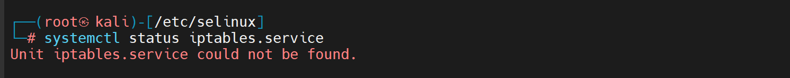

**数据包整个过程会经过每个表的层层检查**

**一般配置的是filter表，最主要的表，在input的部分使用，数据包进入系统上层协议时起作用**

**iptables 工作流程：防火墙会一层层向下匹配规则，直到匹配到，如果没有匹配到最后会走默认规则**

## 实际配置

**iptables 默认没启用服务命令iptables -L 能看到表和链这只是iptables 客户端的命令**

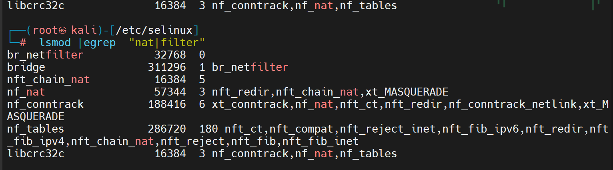

**iptables 并不是真正的防火墙，只是一个应用层的代理，只是向内核部空间中的netfilter 服务添加规则的工具iptabls 配置文件会收到selinux 策略的影响，导致iptables 读取不到对应的配置文件**

**检查iptables 内核模块**

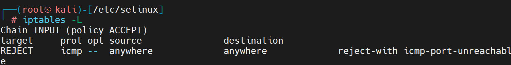

### IP tables 配置详解

**ipable 可以直接配置配置文件 /etc/iptables/rules.v4,也可以通过iptbales 客户端直接配置写入文件**

```
iptables [-t表名] 管理选项 [链名(大写)] [匹配条件]  [-j 动作]

iptables -t 表名 -A/I/D/R 规则链名[规则号] -i/o 网卡名 -p 协议名 -s 源ip/子网 --sport 源端口 -d 目标ip/子网 --dprot 目标端口 -j 动作
```

**常用管理选项：**

**-A : 向规则链(末尾)中追加条目**

**-D :从规则链中删除指定序列号或内容的一条规则**

**-F 清空所有的规则（-X 清理自定义的链，用的少，-Z 清零规则序号）**

**-I :向规则链(开头)中插入条目**

**-R: 替换规则链中的条目**

**-N 创建新的用户自定义链**

**-P 指定链的默认设置**

### 案例

**禁止本机被ping:**

```
iptables -t filter  -I INPUT -p icmp -j  REJECT
```


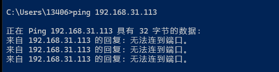

**这时只是用命令行设置的，没有写进配置文件**

** 删除前面那条规则**

```
iptables -t filter -D INPUT -p icmp -j REJECT
```

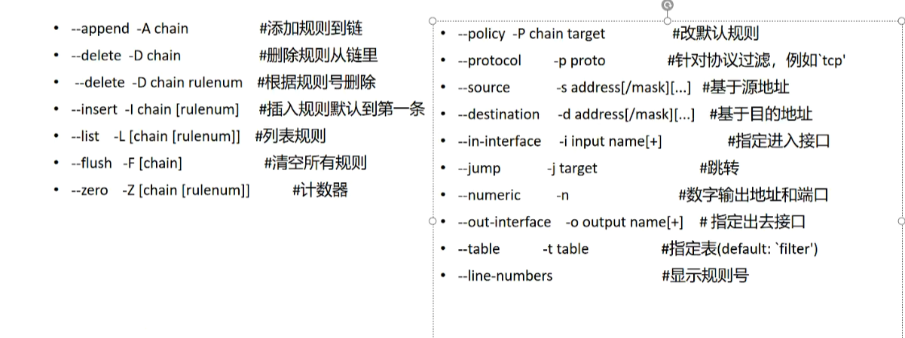

```
iptables -t filter -A INPUT -p tcp -s 192.168.20.1  --sport 6666 -j DROP

iptables -t filter -A INPUT -p udp -s 192.168.20.1  --sport 6666 -j DROP 追加

iptables -t filter -I INPUT 3 -p icmp  -j DROP (在IMPUT链的第三行插入)
```

**删除规则 不指定行号的话是按内容删除**

```
iptables -t filter -D INPUT -p udp -s 192.168.20.1  --sport 6666 -j DROP

#按行号进行删除：

iptables -t filter -D INPUT 2  #删除第二行的规则

```

**指定某个表某个链的默认设置：**

```

iptables -t filter -P INPUT DROP

iptabes -t filter -P INPUT ACCEPT
```

**这时要是不指定行为的话为默认设置**

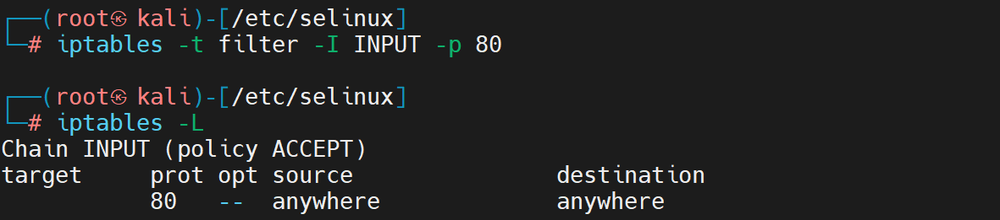

#### iptables的规则匹配条件

**通用匹配：（协议，地址，接口），可以独立使用**

* **协议（传输层和网络层协议），不能是应用层协议（ftp，http） iptables 是工作在4层的**
  * **iptables -I INPUT -p icmp -j DROP  #不让别人ping自己**
* **地址**
  * **iptables -I INPUT -s 192.168.1.110 -j REJECT  # 禁止该主机的包进入**
  * **iptables -I INPUT -s 192.168.1.0/24 -j REJECT # 禁止整个网段进入**
* **物理接口**
  * **iptables -I INPUT  -i eth0  -j REJECT # 禁止这个网卡进入的包**
* **隐含匹配 --sport/--dport 需要指定协议才能使用**
  * **端口匹配  ":" 是范围**
    * **iptables -I INPUT  -p tcp --dport 80 -j ACCEPT #允许80端口的访问 **
    * **iptables -I INPUT -p tcp --dport 20:21 -j DROP # 禁止别人和自己访问自己的FTP端口**
  * **标记匹配**
    * **iptables -I INPUT -i ens33 -p tcp --tcp-falgs SYN,RST,ACK SYN -j DROP **
  * **icmp类型匹配**
    * **iptables -A INPUT -p icmp --icmp-type 8 -j DROP #自己ping别人可， 反之不行 8--> 请求**
    * **iptables -A INPUT -p icmp --icmp-type 0 -j DROP #自己ping别人不行，反值可以 0-->应答**
* **显示匹配（通过调用模块 lsmod|grep xt_ 来加载内核扩展模块，如端口匹配，ip范围，MAC地址，状态等）**
  * **多端口匹配**
    * **-m multiport --sports -m multiport --dports**
    * **iptables -A INPUT -p tcp -m multiport --dport 80,20,22 -j DROP**
  * **ip范围匹配**
    * **-m iprange -src-range **
    * **iptables -A INPUT -p tcp -m iprange --src-range 192.168.1.10-192.168.1.20 -j ACCEPT**
  * **mac地址匹配**
    * **-m mac --mac-source **
    * **iptables -A INPUT -m mac --mac-source 00:0c:38:64:E#:8D -j ACCEPT**
  * **tcp状态匹配**
    * **-m state --state --state **
    * **iptables -A INPUT --m state --state --state ESTABLISHD,RELATED -j ACCEPT**

**一些例子**

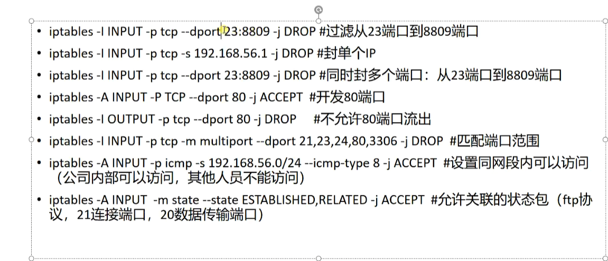**让自己配置的规则持久生效：**

**iptables-save**

**filter 表主要做服务器的流浪控制，控制别人访问服务器的，nat表主要做网关路由，网络地址转换，SNAT和DNAT**

## linux firewalld

**firewalld 也是netfilter 的一个子系统，底层调用的命令任然是iptables 。firewaldd 服务是默认的防火墙配置管理工具，拥有基于cli命令行和基于gui图形用户界面以及直接修改配置文件三种管理方式**

**相较于传统的防火墙管理配置工具，firewalld 支持动态更新技术并加入了区域（zone)的概念。简单来做，区域就是firewalld 预先准别了几套防火墙策略集合（策略魔板），用户可以根据生产场景的不同而选择合适的策略集合从而实现防火墙策略之间的快速切换。**

**命令行：firewall-cmd **
**图形界面：firewall-config (需安装)**
**配置文件：修改xml配置文件进行配置修改**

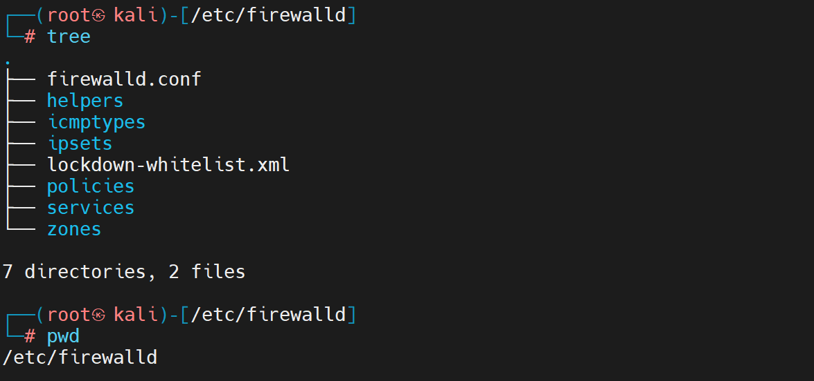

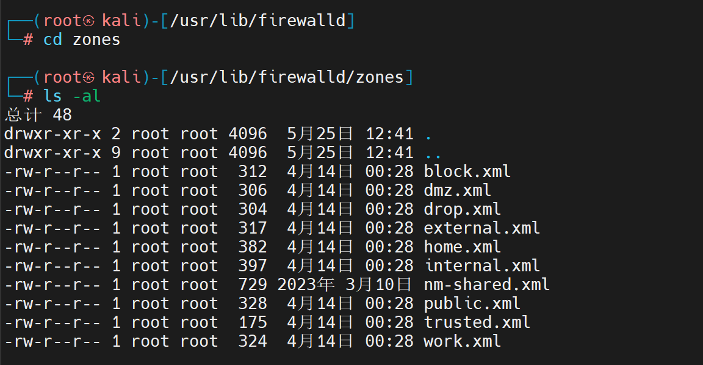

**可以在不同场合下灵活切换策略魔板**

### firewalld 与iptables 对比

* **firewalld 是iptabels 的前端控制器**
* **iptables j静态防火墙任一策略变更需要reload 所有策略，丢失现有链接**
* **firewalld 动态防火墙任一策略变更不需要reload所有策略将变更部分保存到iptables不会丢失现有链接**
* **firewall 提供一个daemon和service 底层使用iptables **
* **基于内核的netfilter**
* **firewalld 默认是拒绝，每个服务要去设置才能开启；iptables 是默认是允许，需要拒绝才去限制**
* **firewalld 支持服务或者应用程序直接添加防火墙规则的接口**

### firewalld 区域管理

**通过网络划分成不同的区域，制定出不同区域之间的访问控制策略来通知不同程序区域间传送的数据流**
**默认是用公共区域（pubilc）**

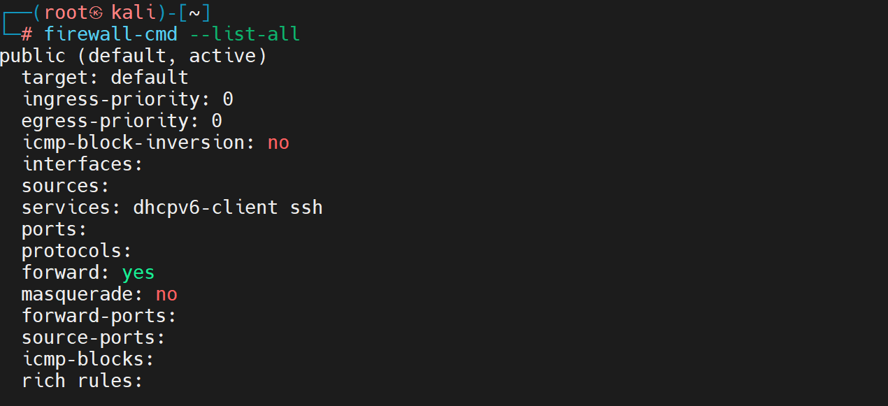

**常用查看命令：**

* **查看服务状态 firewall-cmd --state**
* **查看目前使用的区域  firewall-cmd  --get-default-zone**
* **查看活动区域   firewall-cmd  --get-active-zones**
* **得到所有区域 firewall-cmd  --get-zones**
* **查看可以控制哪些网络服务  firewall-cmd --get-services**
* **设置默认区域 firewall-cmd --set-default-zone=home**
* **查看所有区域的配置 firewall-cmd --list-all-zones**
* **查看public zone 是否能支持ssh协议  firewall-cmd --zone public --query-service=ssh   **
* **查看某个接口在哪个区域: firewall-cmd --get-zone-of-interface=ech0  **

**每个区域要绑定一个网卡，public里面正好默认包含了所有网卡接口**

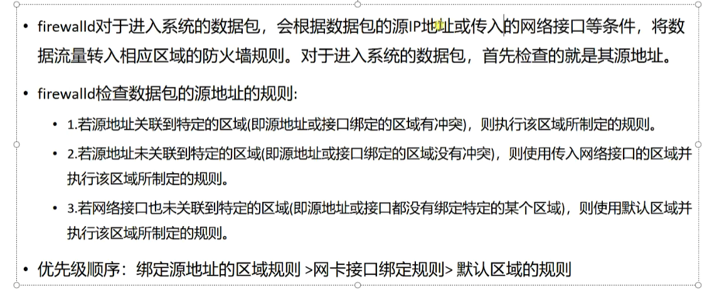

**查源地址，如果源地址没匹配规则则去查流入的接口，如果流入的接口也没绑定区域，则使用默认区域**

**如果一个客户单访问服务器，服务器根据以下原则决定使用哪个区域（zone）的策略去匹配：**

* **如果一个客户端数据包的源地址匹配zone的来源也就是匹配区域的规则，那么该zone的规则就适用于这个客户端，一个源只能属于一个zone 不能同时属于多个zone**
* **如果一个客户端数据包进入服务器的某一个接口如（eth0） 匹配了zone的接口则该zone的规则就适用于这个客户端，一个接口只能属于一个zone，不能同时属于多个zone**
* **如果上述两个原则都不满足，那么默认的zone将被应用firewall数据处理流程，检查数据 的来源地址**

**图形工具：**

**运行时配置和永久配置（运行时配置是服务重启失效，永久配置是写到配置文件里面服务重启生效）**

* **运行时配置： 实时生效并持续到firewalld重启或加载新的配置，不中断现有链接，不修改服务配置**
* **永久配置 不立即生效，除非firewall重启或加载配置，终端现有链接，修改服务配置**

**在选择永久配置后重载防火墙可以看到** `/etc/firewalld/zones/`下面的配置文件已经被修改了

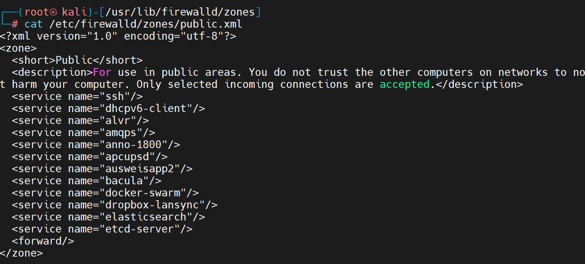

**命令行配置：**

* **firewall-cmd  --add-source= 将源自此ip或子网的流量导向指定的区域**
* **改变某个区域绑定的接口： --zone=xxx --change-interface=xxx**
* **--list-all 显示当前区域的网卡配置参数，资源端口以及服务等**
* **--list-all-zones 显示所有区域的网卡配置参数，资源，端口以及服务等信息**
* **--add-port= <端口号/协议> 设置默认区域允许该端口的流量**
* **--add-service= **
* **--reload 让永久生效的配置规则立即生效，并覆盖当前的配置规则**
* **--permanent 设置永久性规则，服务重启或重启加载时生效**
* **--runtime-to-permanent 将当时的运行时配置写入规则，成为永久性配置**
* **--get-icmptypes 查看防火墙可用的icmp阻塞类型**
* **拒绝所有包：firewall-cmd --panic-on **
* **取消拒绝状态 firewall-cmd --panic-off**
* **查看是否拒绝： firewall-cmd --query-panic**
* **--add 是添加接口 --remove删除接口 **
  ```
  ┌──(root㉿kali)-[/usr/lib/firewalld/zones]
  └─# firewall-cmd  --list-all
  public (default, active)
    target: default
    ingress-priority: 0
    egress-priority: 0
    icmp-block-inversion: no
    interfaces:
    sources:
    services: ssh
    ports:
    protocols:
    forward: yes
    masquerade: no
    forward-ports:
    source-ports:
    icmp-blocks:
    rich rules:

  ```

**target：如果规则中没有显示处理这个包，就走target的处理**
**sources： zone中指定的源**
**masquerade：nat ip 路由功能 **

**配置文件：修改配置文件相当于不是走的firewall服务，相当于直接走的iptabls **

**firewall-cmd --add-service=http**

**firewall-cmd -add-port=80/tcp    这里的tcp 一定要加 **

**富规则：匹配 源 mac 目的地等  通过！ 取反  命令等同于iptables**

```
firewalld-cmd --direct --add-rule ipv4 filter INPUT 1 -p tcp --dport 22 -s 192.168.1.112 -j ACCEPT

firewalld-cmd --direct --add-rule ipv4 filter INPUT 1 -p tcp --dport 22 ! -s 192.168.1.112 -j ACCEPT

firewalld-cmd --direct --remove-rule ipv4 filter INPUT 1 -p tcp --dport 22 -s 192.168.1.112 -j ACCEPT
```

**修改配置文件**

**一次性清空配置时firewalld 没有对应的命令来操作，直接清文件比较方便**
