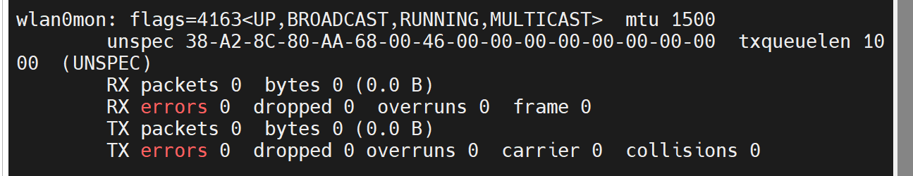
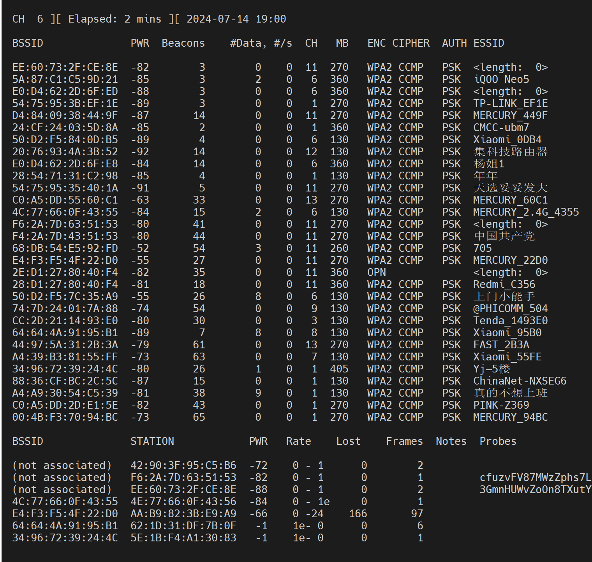
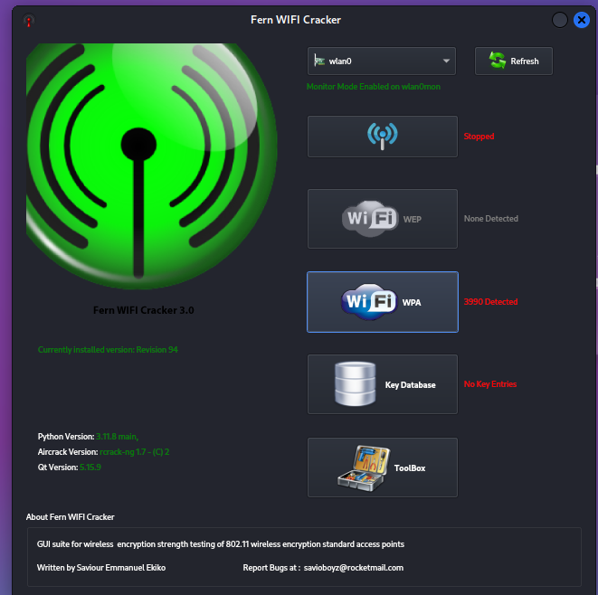
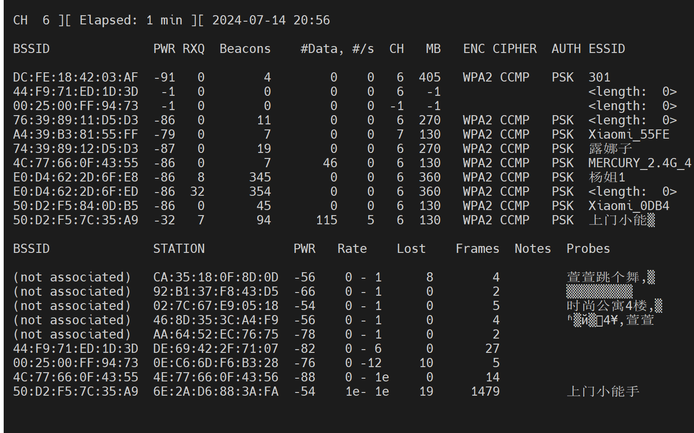
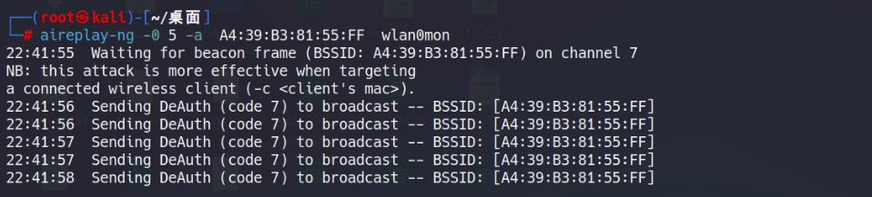
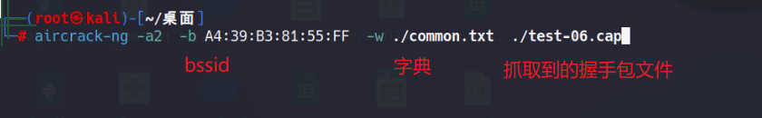
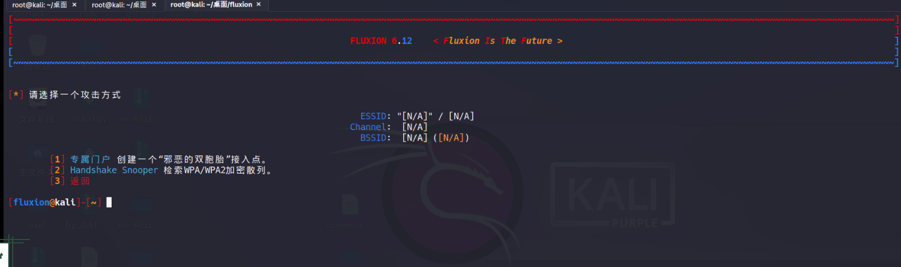
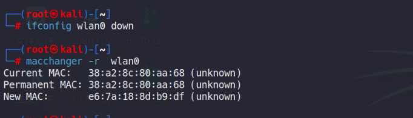
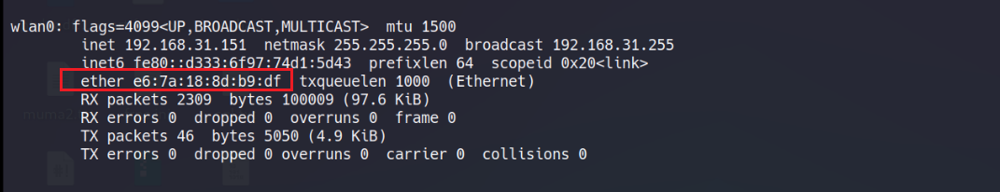

# wifi 攻击

# wifi 常见术语

SSID ：service set identifier ，服务集标识符，用来标识某一无线局域网的唯一标识符，无线客户端用它入网后语接入点进行通信

WAP: wireless application protocol 无线应用协议，利用它可以把网络上的信息传送到移动电话或者其他无线通信终端上

AP access point 无线访问点或者接入点。客户端需要连接AP才能获得登录互联网的能力

WEP wired Equivalent Privacy, 802.11 定义下的一种加密方式，是常见的一种无线网络的认证机制（已淘汰）

WPA WIFI protected Access 常用的无线网络认证机制之一，分为个人和企业的WPA-Persional 和WAP-Enterprise 两种

Station： 站点，网络最基本的组成部门，通常指无线客户端（手机电脑）

BSSID: 基本服务单元ID 在安全软件中通常显示为接入点的MAC地址。SSID和BSSID不一定一一对应，一个BSSID 在不同的信道上面可能会对应到多个SSID 但在一个信道上面他们是一一对应的

信道：Channel,是对频段的进一步划分，比如2.4G的频段 再划分为几个小的频段，每个频段成为一个信道，初五不同传输信道上面的数据，如果覆盖范围没有重叠，那么不会互相干扰。信道荀泽可让设备自动进行

信道宽度：channel WIdth， 例如有20MHz 40Mhz 等，表示一个信道的宽度

## 加密方式

WEP ： 在包多的情况下太容易被解密了（不是秘钥长度问题）已经被淘汰了，不谈

WPA/WPA2 :算法本身几乎无懈可击，所以只能采用暴力破解和字典法

## 攻击准备

kali 虚拟机开接上无线网卡

系统物件网卡配置

- 加载无线网卡ifconfig wlan0 up
- 激活无线网卡到monitor 监听模式  airmon-ng start wlan0 这步会生成一个监听状态的网卡 wlan0mon
- 探测无线网络，抓取无线数据包 `airodump-ng wlan0mon`

` airodump-ng wlan0mon`

上半部分：

PWR 强度

Beacons 信标

CH 信道

ENC 加密方式

AUTH 授权方式 家庭方式一般是psk

下半部分：

BSSID 和上半部分不同

下面显示的是有哪些客户端连接到了这个无线信号

## 攻击方式

最终方式主要有

获取目前输入的账号和密码

获取目标访问url

替换网站信息（图片 恶意js ）

跳转钓鱼网站（同以局域网）

### 破解wep加密：（已淘汰）

虽然现在不用了，但是还是可以学一下的

初始iv 向量：

> 初始向量（IV）是一个重要的概念。 它是 **用于加密算法的随机数** ，通常与密钥一起使用，以确保每次加密数据时产生不同的结果。 IV本身不用于解密数据，但它是加密过程中不可或缺的一部分。

**Aircrack-ng 破解**

- 使用Airodump-ng 监听信号  airodump-ng wlan0mon
- 打开新的终端抓取iv 初始向量 airodump-ng --ivs -w wep -c [num] wlan0mon 注意需要指定信道
- 流量小的情况下，需要使用ARp request 攻击进行流量激发，若信道比匹配，需重复执行命令 aireplay-ng -3 -b 【bssid】 -h 【station】 wlan-mon
- 在/home 下寻找wep-01.ivs命名的初始向量文件，使用工具对其进行破解，需采集足够多的向量 aircrack-ng wep-01.ivs

手上没有支持wep 的设备暂时没法演示

**Fern破解(kali上有图形化界面)**

主要步骤：

- 打开工具，选择无线网卡
- 扫描wep加密的无线信号
- 选择目标信号，勾选arp request，开始破解

得到的结果与上面那种方式相同

### 攻击抓取握手包并暴力破解

> WPA/WPA2 与WAP/WAP2-PSK的区别
>
> wpa 加密算法，路由器将使用radius服务器进行身份认证并得到秘钥的WPA或WPA2安全新式因为要架设一台专用的认证服务器，价值对比贵重且保护也很杂乱，所以不推荐破铜用户运用此类安全类型
>
> WPA-PSK/WPA2-PSK
>
> WPA-PSKWPA2-PSK安全类型其实是WPA/WPA2的一种简化版别，它是依据同享密钥的WPA形式，安全性很高,设置也对比简单，合适普通家庭用户和小型企业运用。
>
> 认证类型:该项用来挑选体系选用的安全形式，即主动、WPA-PSK、WPA2-PSK。
>
> 主动:若挑选该项,路由器会依据主机恳求主动挑选WPA- PSK或WPA2-PSK安全形式。
>
> 加密算法:该项用来挑选对无线数据进行加密的安全算法，选项有主动、TKIP、 AES。
>
> 默许选项为主动,挑选该项后,路由器将依据实践需求主动挑选TKIP或AES加密办法。留意11N形式不支持TKIP算法。
>
> PSK暗码:该项就是WPA- PSK/WPA2 PSK的初始密钥了，在设置时，需求为8- 63个ASCII字符或8-64个十六进制字符。
>
> 组密钥更新周期:该项设置播送和组播密钥的定时更新周期，以秒为单位，最小值为30，若该值为0，则表示不进行更

获取wpa2-psk 握手包

- 设置无线网卡为监听模式： airmon-ng start wlan0
- 扫描周围WPA2-PSK 加密的无线信号 airodump-ng wlan0mon
- 新开一个终端，抓取握手包 ariodump-ng -c 【CH 】 -w wpa2 wlan0mon 需要指定信道
  也可以指定抓某个AP的包，这有助于我们精确目标
  ` airodump-ng -d 68:77:24:65:EE:CF -c 6 wlan0`
- 等待过程中配合Deauth 攻击，将客户端强制踢下线重新连接，抓取握手包 aireplay-ng -0 5 -a 【BSSID】-c STATION wlan0mon 设置为发起5次攻击，可能会出现信道不同的提示，需要重复执行，如果不选-c 的参数的话，就是把连接在这个AP上的设备统统踢下线
- 等待监控窗口提示 WPA handshaks
- 用ewsa 工具破解握手包（wdindows下）
- 使用aircrack-ng （kali） 对握手包进行暴力破解 `aircrack-ng -a2  -b [bssid] -w [字典]  [抓到的握手包]`

演示：

监听

deauth攻击抓取握手包

破解

### 同名wifi钓鱼

Evil Twins 攻击： WiFi 干扰将目标 WiFi 全部设备踢下线，然后 Evil twins 复制出与目标一样的 SSID，被踢下线的设备连入复制 WiFi ，再向其发送钓鱼页面。

#### Fluxion 实现wifi钓鱼:

a.扫描能够接收到的WIFI信号

b.抓取握手包（这一步的目的是为了验证WiFi密码是否正确）

c.使用WEB接口

d.启动一个假的AP实例来模拟原本的接入点

e.然后会生成一个MDK3进程。如果普通用户已经连接到这个WiFi，也会输入WiFi密码

f.随后启动一个模拟的DNS服务器并且抓取所有的DNS请求，会把请求重新定向到一个含有恶意脚本的HOST地址

g.随后会弹出一个窗口提示用户输入正确的WiFi密码

h.用户输入的密码将和第二步抓到的握手包做比较来核实密码是否正确

j.这个程序是自动化运行的，并且能够很快的抓取到WiFi密码

`git clone https://github.com/FluxionNetwork/fluxion.git`

./fluxion.sh -i 自动化安装依赖

较为友好的交互界面，具体使用不展开讲

#### wifipumpkin3

#### wifiphisher

#### macchanger 修改mac地址

ifconfig wlan0 down

macchanger -r wlan0 (给wlan网卡生成一个随机mac)

ifconfig wlan0 up

### wifi ARP 攻击

在kali 中可以利用ettercap 和aprspoof等攻击进行攻击，但是这种攻击目前仅对htp网站有效

### 洪水攻击

所谓洪水攻击，换个通俗易懂的说法便是WiFi干扰。类似与ddos攻击。通过发送大量的请求去连接WiFi，导致路由器无法处理大量的连接请求，从而迫使正常用法断开连接无法使用网络。

### python pywifi 模块

### （3）伪造802.1x认证源捕获用户名和哈希

802.1x认证的WiFi，需要终端同时提供一个用户名和密码并传递给Radius服务进行后续验证，验证成功后，认证服务使用认证者的信息生成临时通话密钥，因此针对WPA2模式的抓握手包思路无法实现。 WiFi本身信号范围较为有限，为了优化用户体验，往往会设置自动搜索信号且尝试自动重连的机制。在大型企业组网中，单无线信号源无法实现大面积区域的覆盖，往往会使用多AP的模式部署无线网，无线终端在跨区域移动时可自动接入信号最佳的AP信号源，避免了反复重连导致用户体验降低。因此可以确认，大部分无线终端都会开启自动重连机制，且仅通过ESSID进行区分。 因此只需要通过修改Radius服务端，伪造ESSID与目标单位相同的WiFi信号源，当其员工从我方信号源附近经过时，就可以捕获到终端自动发起重连时的数据包，其中包含明文用户名和NetNTLM哈希，实战测试中可知，AMD公司的入门级GPU RX6700xt可以以5000MH/s的速度爆破NetNTLM。

如果目标使用了802.1xEAP扩展身份认证协议，攻击者伪造的radius服务无法成功的捕获哈希，但仍然可以捕获到域、主机名或用户名等信
