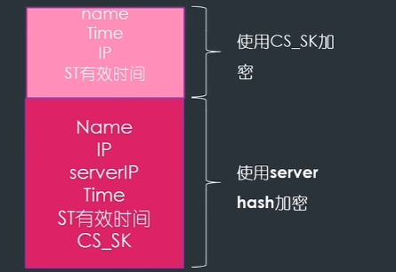

# Kerberos&&黄金白银票据

windows 三大认证：

- 本地认证:自己登录自己的电脑
- 网络认证：两个电脑之间的认证（最大的问题是双方不能证明自己是自己，其实是不安全的）ntml重放攻击，ntml截取攻击
- 域认证：kerberos认证 不依赖于主机操作系统的认证，不需要所有主机物理安全，并嘉定网络上传输的数据包可以被任意的读取，修改，和插入数据

kerberos 协议中存在三个角色，分别是

- 客户端：发送请求的一方
- 服务端：接受请求的一方
- 秘钥分发中心（KDC），秘钥分发中心氛围两个部分，分别是：
  - AS (Authentication Server): 认证服务器，专门用来认证客户端的身份并发放客户用于访问TGS的TGT
  - TGS :票据授予服务器，用来发放整个认证过程以及客户端访问服务端时所需的服务授予票据

kerberos  客户端访问服务端分为3步：

- AS
- TGS
- 服务端

电脑中的实现方式：

第一步：客户端拿着 `身份信息`去AS认证，AS拿着身份信息去数据库里查一遍认证后AS返回TGT

`身份信息`包括 Name（用户名），IP（地址），Time（当前时间）
*域内用户枚举攻击*的原理：kerberos的第一步，看看对方是否会返回tgt来确认内网有多少个用户

TGT 的内容：

- Time：当前时间
- TGSname：之后用户要访问的TGS的name (Tgs server 不止一个)
- TGT有效时间
- CT_SK  CT_session_key是一段随机的字符串

以上部分使用用户密码的HASH进行加密，只有对应的用户可以解开，可以获得CT_SK随机字符串

第二部分：由krbtgt 的hash加密的，krbtgt 是KDC其中用来发TGT的一个专门的用户
这部分加密的原因：防止攻击者伪造tgt凭据，攻击者解不开加密，无法知道里面的内容，就无法伪造tgt

**伪造TGT的第二部分就是黄金票据**

客户端处理TGT的过程：

- 用HASH解密第一部分，拿到CT_Sk
- 需要指定自己要去访问的服务名 kerbros中 访问不同的服务需要不同的认证
- NAME,IP,TIME 用CT_Sk 进行加密，放在第一段，TGT中krbtgt加密的部分放在第二段，最后放上要去访问的服务名

KDC 处理用户发过来的TGT 步骤：

- 用HASH解开第二部分，获取本次使用的CT_SK,用CT_SK解开第一部分，获取到客户端的信息
- 将第一部分的信息和第二部分中的信息进行对比，确认没有被伪造

确认未被伪造后，KDC 返回给客户端一份ST：
ST包含以下内容：

- 第一部分：用CT_SK加密：
  - Time  ST 的有效时间
  - CS_SK (注意是CS,不是之前的CT)
- 第二部分：用server 的HASH 进行加密：
  - Name
  - ip
  - serverip
  - time(ST的有效时间)
  - CS_SK

客户端处理CS过程：

- 将第一部分用CT_SK 加密解密，拿到CS_SK
- 用CS_Sk 加密NAME,IP，TIME ，ST有效时间 作为第一部分
- 将ST的第二部分原封不动的带上发给SERVER

Server 处理ST步骤

- server 用hash 解开第二部分，获取CS_SK
- 用CS_SK 解密第一部分，获取用户信息
- 对比第一部分和第二部分的用户信息

如果验证成功就给客户端提供服务

## 深入理解黄金白银票据攻击

### 黄金票据： 伪造TGT 可以访问任意服务

要伪造TGT，需要用到 `krbtgt用户的hash`(不可以伪造)
CT_SK的伪造并不是重要的，CT_SK是可以伪造的，只需要TGT的第二部分中伪造的CT_SK 和第一部分中用来加密的CT_SK 一致即可，KDC 用自己的hash 解密第二部分后得到假的CT_SK 解密第一部分的内容能解开就行了

**重点是 如何伪造 krbtgt的hash**  换句话说，伪造krbtgt 的hash 就叫做黄金票据
伪造了黄金票据就能控制 `域内`所有服务和计算机

黄金票据的伪造条件：

- 域名称
- 域的SID值 （shell whoami/user）
- 域的KRBTGT 账号的Hash (isadump::dcsync /domain:test.com /all /csv)
- 伪造任意用户名（随便写）

### 白银票据 ：伪造ST 只能访问单个服务

伪造白银票据同理主要是要获取到server的hash值
server 的hash在KDC上和server 上都有

## 委派

kerberos 协议模型无法满足日常工作需求

举例：客户端需要从web上下载一个文件，但是文件并不在web系统上，而是在文件系统上，web系统需要代替用户去向文件系统请求文件，之后再给客户端，这个过程就是域内委派（不是ssrf）

委派分为两种：约束性委派和非约束性委派

- 非约束性委派：对委派的机器没有显示，不做任何约束，这样是非常不安全的。如果攻击者控制了web系统，就可以伪造用户向文件系统要文件，在非约束性委派中，没有对委派的机器做限制，攻击者可以访问文件系统，数据库系统等所有服务，也就是入侵者可以控制域内所有服务（电脑）A在委派web,要给出自己的TGT, web服务器拿着A的TGT ，以A 的身份去向KDC申请一份访问文件系统的ST2,用ST2去访问文件系统

漏洞触发条件： 攻击者拿到web服务器之后可以通过委派的方式获取到其他的服务

委派攻击单独开一章来记录
