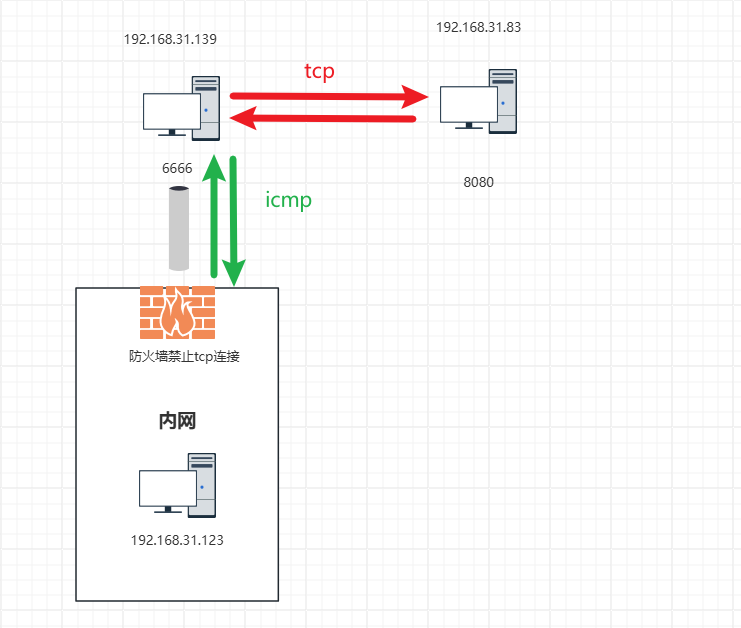

# 隧道与VPN

隧道和vpn的实现就是建立一条虚拟专线实现对端的访问，实际上是走的公网
通过特定协议的多层封装，数据包在到达对端时候再次解封目的 地址和源ip都是两边的内网ip，实现内网与内网的访问

本文主要介绍几种简单协议搭建隧道的方法

大致模型：


```
正常包发出时
src:1.1.1.1
dst:2.2.2.2

vpn包
src:1.1.1.1
dst:2.2.2.2
  封装层
   src:192.168.10.1
   dst：10.10.10.1
```

两边接口的路由器解开封装层后获取目的地址，转发到对应的内网节点

## SSH隧道

前面说过，隧道就是在正常的流量包上做了特定的协议封装

作用：

- 转发tcp流量数据
- 加密明文数据

### ssh端口转发

ssh 客户端监听端口指定端口，将接受到的数据加密后传输到远端ssh服务器，远端ssh服务器再传输到指定的远端端口，中间过程是由ssh加密传输

涉及ssh参数

* `-L local_port:remote_host:remote_port`：本地端口转发。
* `-R remote_port:local_host:local_port`：远程端口转发。
* `-D [bind_address:]port`：动态应用程序级端口转发。
* `-N`: 不执行ssh 命令，仅做端口转发
* `-f` ：让ssh 后台运行
* `-g `: 允许远程主机连接到本地转发的端口。

#### 本地端口转发

如果应用程序的客户端和 SSH 的客户端位于 SSH 隧道的同一侧，而应用程序的服务器和 SSH 服务器位于 SSH 隧道的另一侧，那么这种端口转发类型就是本地端口转发

命令

`ssh -fLN <localport>`:localhost:`<remoteport>` remoteip`

```

# 192.168.31.83 
python -m SimpleHTTPServer 8080

# 192.168.31.139

[root@almalinux ~]# curl http://192.168.31.83:8080/test.txt
haha,you got me !!

[root@almalinux ~]# ssh -fNL 6666:localhost:8080 192.168.31.83
root@192.168.31.83's password:

[root@almalinux ~]# ss -panut |grep 6666
tcp   LISTEN 0      128                127.0.0.1:6666         0.0.0.0:*     users:(("ssh",pid=1851,fd=5))
tcp   LISTEN 0      128                    [::1]:6666            [::]:*     users:(("ssh",pid=1851,fd=4))

[root@almalinux ~]# curl 127.0.0.1:6666/test.txt
haha,you got me !!


#192.168.31.83
[root@centos7 ~]# netstat -pantu |grep  192.168.31.139
tcp        0      0 192.168.31.83:22        192.168.31.139:33212    ESTABLISHED 4464/sshd: root


```

加上 -g参数

```
[root@almalinux ~]#  ssh -gfNL 6666:0.0.0.0:8080 192.168.31.83
root@192.168.31.83's password:

```


简单拓扑：

其中管道表示ssh隧道（有加密传输的部分）


通过一台服务器做tunner 的本地转发

命令

`ssh -fNL localport:remotehost:remoteport user@tunnalhost`

```
 #windwos
ssh -fNL 6666:192.168.31.83:8080 root@192.168.31.139

>curl 127.0.0.1:6666/test.txt
haha,you got me !!


```

拓扑


抓包分析

#### 远程端口转发

远程转发指的是在远程 SSH 服务器建立的转发规则。

它跟本地转发正好反过来。建立本地计算机到远程 SSH 服务器的隧道以后，本地转发是通过本地计算机访问远程 SSH 服务器，而远程转发则是通过远程 SSH 服务器访问本地计算机

**如果应用程序的客户端和 SSH 的服务器位于 SSH 隧道的同一侧，而应用程序的服务器和 SSH 的客户端位于 SSH 隧道的另一侧，那么这种端口转发类型就是远程端口转发**

命令

`ssh -fNR remote-port:target-host:target-port-N remotehost`

远程端口转发不支持-g 参数,但是ssh监听的端口默认是0.0.0.0，其他服务器可以直接访问

```

# 192.168.31.83
ssh -fNR 6666:localhost:8080 192.168.31.139

# 192.168.31.139

[root@almalinux ~]# netstat -pantu |grep 6666
tcp        0      0 0.0.0.0:6666            0.0.0.0:*               LISTEN      2133/sshd: root
tcp6       0      0 :::6666                 :::*                    LISTEN      2133/sshd: root
[root@almalinux ~]# curl 127.0.0.1:6666/test.txt
haha,you got me !!

#windos
curl 192.168.31.139:6666/test.txt
haha,you got me !!


```

简单拓扑


远程端口转发特点是如果有限制 192.168.31.83是内网，公网无法访问时，可以反向让83去脸公网的139实现端口转发

抓包分析

#### 动态端口转发

相对于动态端口转发，前面介绍的端口转发类型都叫静态端口转发。所谓的 "静态" 是指应用程序服务器端的 IP 地址和监听的端口是固定的

动态端口转发可以在本地(ssh 客户端)主机上创建一个socket作为一个SOCKS代理服务器。当客户端连接这个端口，连接就被转发到远程(ssh服务器)主机，然后被转发成为ssh服务器的动态端口，数据流就会主机转发到目标主机时显示为ssh服务器上的动态端口和IP。数据返回也会通过这个加密通道返回给连接ssh客户端上socket的应用。

命令格式

`ssh -D localhost:localport user@ssh_server` 不需要远程主机端口

这时候 使用proxychains 工具就能使用socket 代理了

## ICMP 隧道--网络层隧道（通过icmp echo 包进行传输数据）

icmp隧道原理：改变操作系统默认在icmp echo包中填充的Data，替换成我们自己的数据

icmp隧道优点：icmp报文是由系统内核处理的，不占用任何端口，因此具有很高的隐蔽性

icmp 隧道缺点：

- ICMP隐蔽传输是无连接的，传输不是很稳定，而且隐蔽通道的带宽很低
- 利用隧道传输时，需要接触更低层次的协议 ，这就需要高级用户权限。

场景：上层隧道都不能用的时候可以尝试使用icmp隧道

攻击机无法和跳板机，目标机器之间建立tcp连接（访问限制）但是和跳板机之间的icmp 没有被限制
这时可以使用icmp 隧道技术让跳板机作为中介实现对目标机器的访问（仅限于tcp）



创建icmp隧道的常见工具：ptunnel、icmpsh、icmptunnel

命令使用

`ptunnel -p 跳板ip -lp 本地端口 -da 目标ip -dp 目标端口 -x 密码（可选）`

```


#server 10.168.31.139

[root@almalinux /]# ptunnel  -x password
[inf]: Starting ptunnel v 0.72.
[inf]: (c) 2004-2011 Daniel Stoedle, <daniels@cs.uit.no>
[inf]: Security features by Sebastien Raveau, <sebastien.raveau@epita.fr>
[inf]: Forwarding incoming ping packets over TCP.
[inf]: Ping proxy is listening in privileged mode.


# kali 10.168.31.123
ptunnel -p 192.168.31.139 -lp 1080 -da 192.168.31.83 -dp 8080 -x  password

──(root㉿kali)-[~]
└─# netstat -pantu |grep 1080
tcp        0      0 0.0.0.0:1080            0.0.0.0:*               LISTEN      36226/ptunnel   

┌──(root㉿kali)-[~]
└─# curl 127.0.0.1:1080/test.txt
haha,you got me !!


```

在kali 上启动抓包可以看见，在访问的时候发出和收到的全是icmp 包


icmp隧道包修改的data字段


ptunnl 日志


## socket隧道

多种工具都可以搭建

## DNS隧道

**DNS隧道分为两种：**

直连模式：客户端直接向指定IP地址的DNS服务器发起DNS解析请求

中继模式：DNS经过正常dns服务器是公网的dns互联网的迭代解析，指向指定的DNS服务器。

区别在于直连模式速度相对快，但安全性相对较差。非直连模式速度相对较慢，但安全性相对较高。大多数情况下都使用中继模式。

（另外直连方式的限制比较多，如目前很多的企业网络为了尽可能的降低遭受网络攻击的风险，一般将相关策略配置为仅允许与指定的可信任DNS服务器之间的流量通过。）

**本次搭建的是中继dns隧道**


这里我使用内网自己搭建的dns服务来进行简单的实验，目标还是192.168.31.83:8080

在192.168.31.139上搭建dns服务器：

`yum install bind -y`


将监听端口和允许查询改为 `any`

定义正向查询：

```
zone "eiraaa.com" IN {
        type master;                    # 表明这是主 DNS 服务器，负责提供 "eiraaa.com" 区域的数据。
        file "eriaaa.com.zone";         # 指定了包含 "eriaaa.com" 区域数据的文件的路径。
        allow-update { none; };         # 不允许动态更新
};   

```

检查是否有语法错误

`named-checkconf  /etc/named.conf`

启动dns 服务

`systemctl restart named`

修改正反区域文件

进入到DNS服务器相关文件存储目录 `/var/named/`


`cp -p named.empty eiraaa.com.znoe ` 正向解析

`cp -p named.empty eriaaa.com.zone`  反向解析

这里用正向解析就行了 `eiraaa.com.znoe` 内容如下

```
$TTL 3H
@       IN SOA   eiraaa.com. root.eiraaa.com (
                                        0       ; serial
                                        1D      ; refresh
                                        1H      ; retry
                                        1W      ; expire
                                        3H )    ; minimum
@       IN NS   dns.eiraaa.com.
dns     IN A    192.168.31.123
tunnl   IN A    192.168.31.123

```

重启named 服务

调整selinux 的bind配置

`setsebool -P named_write_master_zones 1`

将192.168.31.83 的 /etc/resolve.conf  中nameserver 改为192.168.31.139


到此，dns服务器搭建完成


### iodine DNS隧道搭建


### dnscat2 DNS隧道搭建


### dns2tcp DNS隧道搭建

## SMB 隧道

网上基本都是通过cs 搭建的，暂不讨论

## HTTP 隧道

## 隧道嵌套
