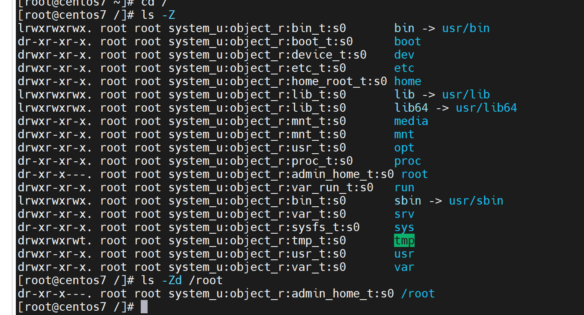
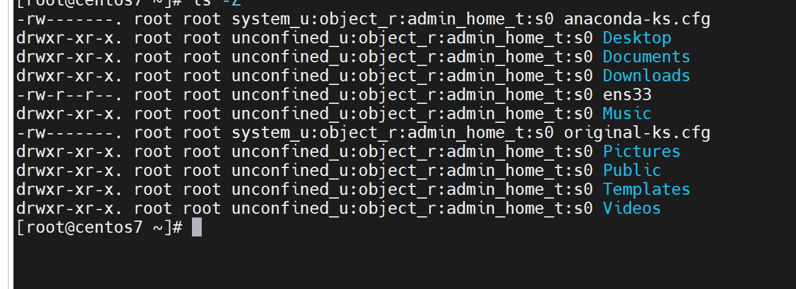
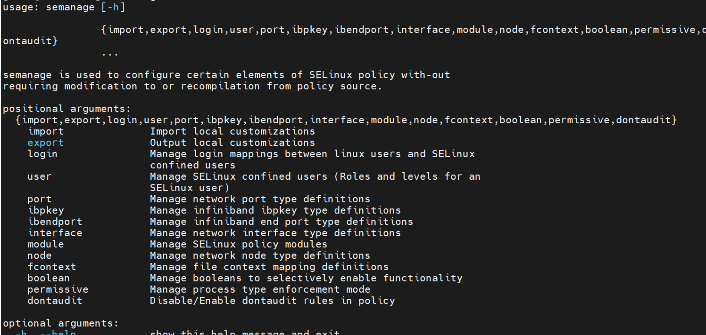

# Selinux

linux 内核版本2.6以上自带 selinux

给服务划分权限，即使有一个服务被攻陷， 整个服务器的最高权限依然还在

SELinux 特点：

1.MAC(Mardatory Access Control) 对访问的控制彻底化，对所有的文件、目录、端口的访问都是基于策略设定的

2.RBAC（Role Base Access Control ）对于用户只赋予最小权限，对于用户来说，被划分成一些role 即使是root 用户，不在sysadm_r 里面，也不能执行sysadm_t 管理操作

3.TE (type enforcement) 对进程只赋予最小运行权限 ，TE 概念在SELinux 中非常重要，其特点是对文件赋予一个叫type 的文件类型标签，对进程赋予一个叫domain的标签；可以规定某个进程只能执行某类型文件

**配置文件位置：  /etc/selinux/config**

**查询当前启动状态： getenforce
强制 enforcing   允许 permissive  禁用 Disabled**

切换selinux 状态：

关闭—> 开启 ：无法通过setenforce 命令来开启 必须通过改 配置文件实现

```
┌──(root㉿kali)-[~]
└─# setenforce 1
setenforce: SELinux is disabled
```

还可以再grub2 配置的启动项里面配置

**安全上下文概念**

security context: 安全上下文

system_u:object_rhttpd_sys_content_t

用户          角色                   类型

policy:策略（控制规则，哪些进程可以访问 哪些资源）

进程的安全上下文是域domain

系统根据pam 子系统中的 /lib64/security/pam_selinux.so 模块设定登陆者运行程序的安全上下文

rpm 包安装会根据rpm包的内记录来生成安全上下文

手工创建的文件根据policy中规定来设置安全上下文

cp 重新生成安全上下文 mv不会改变安全上下文

安全上下文格式：

1.user 类似域linux 系统重的UID 提供身份识别

常见的三种user

- user_u ： 普通用户登录系统后预设
- system_u： 开机过程中系统进程的预设；管理员
- unconfined_u： 非限制，没有做定义

2.role

文件与目录的role 通常是objdect_r
程序的role,通常是system_r;
用户的role 类似域系统重的gid，不同的角色具备不同的权限；
用户可以具备多个role；但是同一时间内只能使用一个role

3.type

type 用来将主体与客体划分为不同的组，每个主体和系统重的客体定义了一个类型，为进程运行提供最低的权限环境

目录



文件



修改上下文

  chcon
以一个文件做参照

chcon --reference=xxxxx  xxxxx

安全上下文预设文件

/etc/selinux/targeted/contexts/files/file_context

**selinux 策略**

1. getsebool 命令查看selinx 策略 策略：作用，指定进程可以访问哪些文件

获取本机的selinux 策略只：getsebool -a

selinux 的设置一般通过两个部分完成，一个是安全上下文，另一个是策略，策略是对安全上下文的补充


## semanage 





服务对应端口查询和修改
