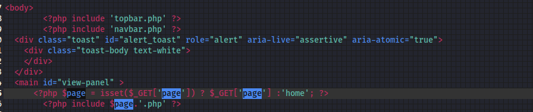

# 文件包含

一般要有地方上传shell.php 或者其他的shell，然后当页面url中有xxxxxx.php?file=xxxx这样的页面时候通过修改后面的参数可以查看/etc/passwd文件等操作

之后的操作有：
1）将file直接包含已经上传的反弹shell,得到立足点
2）可以使用php伪协议读取网站内php源代码和各种

条件竞争，日志投毒可以利用文件包含进行rce

一般常用到的路径如下：

`/var/log/nginx/access.log`
`/etc/apache2/apache2.conf`

1. Linux：
   • 主配置文件：/etc/nginx/nginx.conf
   • 网站配置目录：通常是/etc/nginx/conf.d/ 或 /etc/nginx/sites-available/，但具体路径可能因操作系统和NGINX版本而异。

• Debian/Ubuntu：
◇ 主配置文件：/etc/nginx/nginx.conf
◇ 网站配置目录：/etc/nginx/sites-available/
◇ 启用的网站配置文件：/etc/nginx/sites-enabled/

• CentOS/RHEL：
◇ 主配置文件：/etc/nginx/nginx.conf
◇ 网站配置目录：/etc/nginx/conf.d/

• Windows：
◇ 主配置文件：通常在NGINX安装目录下的conf文件夹中，如C:\nginx\conf\nginx.conf。

还可以看一些proc下面的东西但是一般要root权限

有一种是index.php?page=dash,这种没有后缀的,采用这样的读取方式,如这样，就只能读取php文件

index.php?page=php://filter/convert.base64-encode/resource=deductions
或者
index.php?page=php://filter/php://filter/convert.base64-encode/resource=deductions

另一种是index.php?page=dash.php这种有后缀的，两种的文件读取使用的方式是不同的，第一种没法直接读取/etc/passwd,需要用到php://filter，第二种可以直接读取
