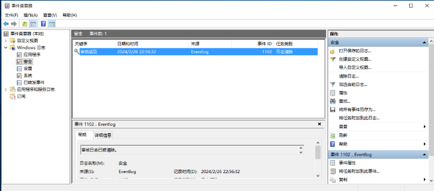
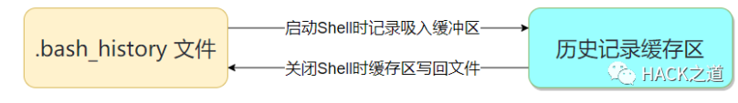
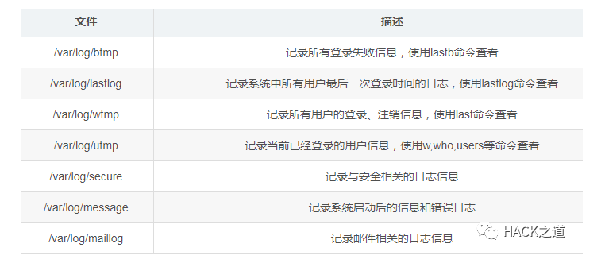
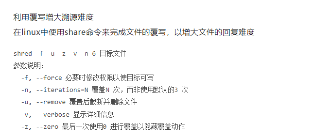

# 痕迹清理

## windows 痕迹清理

删除记录：（需要高权限权限）[https://www.moonsec.com/6407.html](https://www.moonsec.com/6407.html)

win+R  eventvwr  图形化界面进行删除

cmd中

powershell  -command "{clear-eventlog -log setup }"  “setup  可换成 security  system 等”

好像没有什么软用

进入powershell

Get-WinEvent -ListLog security -Force | ForEach-Object {Wevtutil.exe cl $_.Logname}

这个实测能删除



暴力删除日志文件：

1、停止windows event log （Eventlog ）服务 `net stop EventLog`

2、删除对应的文件 %systemroot%system32winevtlogs

3、 永久停用方法：

`# 查询要禁用的注册表`

`reg query "HKEY_LOCAL_MACHINE\System\CurrentControlSet\Services\EventLog"`

`# 删除对应的注册表`

` reg delete "HKEY_LOCAL_MACHINE\System\CurrentControlSet\Services\EventLog"  /f`

`# 重启Windows Event Log（EventLog） 服务`

net stop EventLog

reg query windows 下用命令行查看注册表所用的命令

### **使用wevtutil命令行删除**

 (有效)

`# 进入cmd# 查询 wevtutil el所有系统日志`

`#删除对应日志，以清空系统日志为例`

` wevtutil cl system`

wevtutil qe security /f:text /rd:true /c:10 查看近10条的安全记录

### 删除某指定单条记录

`# 1、删除Security下的单条日志(EventRecordID=2222)，并保存为tmp1.evtx`

`wevtutil epl Security tmp1.evtx "/q:*[System [(EventRecordID!=2222)]]"`

`# 2、结束日志进程(释放日志文件句柄)`

`# 3、替换原日志文件`

`# 4、重启日志服务`

### 删除某指定多条记录

`# 1、删除Security下的多条日志(EventRecordID为13030、13031和13032)，结果保存为tmp2.evtx`

`wevtutil epl Security tmp2.evtx "/q:*[System [(EventRecordID>13032) or (EventRecordID<13030)]]"`

`# 2、结束日志进程(释放日志文件句柄)`

`# 3、替换原日志文件`

`# 4、重启日志服务`

### 按时间段删除

`# 1、删除SystemTime为2021-12-10T03:20:00至2021-12-10T03:21:00之间的日志，结果保存为1.evtx`

`wevtutil epl Security 1.evtx "/q:*[System [TimeCreated[@SystemTime >'2021-12-10T03:21:00' or @SystemTime <'2021-12-10T03:20:00']]]"`

`# 2、结束日志进程(释放日志文件句柄)`

`# 3、替换原日志文件`

`# 4、重启日志服务`

### **三. Windows远程连接日志清理**

### 当我们使用3389端口远程一台机器后会在对应机器上产生对应的记录，其记录只要有两部分组成；

### 1、Default.rdp文件(系统隐藏文件)

### 2、注册表记录

### 所以清理痕迹主要是清理rdp文件以及注册表中记录

### 1、删除Default.rdp方法

del /s /q %userprofile%\Documents\*.rdp

### 2、注册表清理方法

`# 查询远程连接在注册表中的键值reg query "HKEY_CURRENT_USERSoftwareMicrosoftTerminal Server ClientDefault"`

`# 删除对应的键值,如删除MRU0 "/v MRU0"reg delete "HKEY_CURRENT_USERSoftwareMicrosoftTerminal Server ClientDefault" /f /v MRU0`

### 3、如使用当前机器作为跳板的话需要使用同步骤清理Servers下的键值

`# 查询具体要删除的键值文件夹reg query "HKEY_CURRENT_USERSoftwareMicrosoftTerminal Server ClientServers"# 确定要删除的文件夹进行删除reg delete "HKEY_CURRENT_USERSoftwareMicrosoftTerminal Server  ClientServers192.168.84.128" /f`

查看用户最近访问的文件

### C:\Users\用户名\AppData\Roaming\Microsoft\Windows\Recent

### **利用覆写增大溯源难度**

### cipher /w:X # 其中X指盘符或文件具体位置

`cipher会分三次写入：第一次写入0x00，第二次写入0xff，最后一次写入随机数字`

要永久删除增加难度要使用这个命令

## Linux 痕迹清理

**Linux的痕迹清理技术大致可以分为两类；**

**1、清理登录记录以及Host记录**

**2、清理日志文件**

Linux清理登录记录以及Host记录方法

**隐藏远程ssh登录记录  隐身登录系统，不会被w、who、last等指令检测到**

`ssh -T user@host /bin/bash -i `

**不记录ssh公钥在本地.ssh目录中**

ssh -o UserKnownHostsFile=/dev/null -T user@host /bin/bash –i

**history  清理**

history 原理：



# 清空当前历史记录(只是清空缓存中的历史记录，伪删除)

`history -c`

将当前缓存中的历史记录写入文件(缓存中的记录是空的-用空的数据写入文件，将文件内容删除)

`history -w`

### **当前shell终止history记录**

### 方法一：

`# 设置当前shell内的命令不再记入日志中，命令会被记录到历史记录中，可以尝试在命令前添加空格让记录不被记录   `

`     set +o history`

`# 如果需要重新记入日志，可以设置-o参数`

`set -o history`

### 方法二：

`# 清除当前shell缓存命令记录，当前session之后的命令不会再记录，不会删除history⽂件中的记录。unset HISTORY HISTFILE HISTSAVE HISTZONE HISTLOG`

### **禁用History方法**

方法1：

编辑/etc/profile并添加HISTSIZE=0

方法2：

在当前shell中直接输入命令HISTSIZE=0 && HISTFILESIZE=0，这样会将缓存的history记录和~/.bash_history中的 记录全部清空；

方法3:

在~/.bashrc初始化文件中添加命令：HISTSIZE=0 && HISTFILESIZE=0，这样每次开启shell都不会再记录history命令。

删除指定命令记录方法

# 筛选要删除的关键字history | grep "keyword"

# 根据编号进行删除history -d num

# 或者进行批量删除(只保留15行)sed -i '15,$d' .bash_history

### **Linux日志清理**

由于Linux的设计采用万物皆文件的思想，所以Linux系统的日志基本都是以文件的形式体现，所以相对Windows而言，Linux的日志清理和修改相对比较容易（虽然Windows也很简单）



全部删除影响较大，容易被发现，因此不推荐

删除的方式一般似乎用空字符写满整个文件，需要root权限 以下命令皆可实现

```
cat /dev/null > filename

: > filename

> filename

echo "" > filename

echo > filename

```

**针对性修改或删除**

- 针对性修改，动作较小，较难被发现

- 利用sed 命令完成修改与删除

修改:

`sed -i 's/要被取代的字符串/新的字符串/g' 目标文件`

删除:

`sed -i '/要删除的内容/'d 目标文件`

### 利用grep -v完成删除

# 1、将目标文件中带有关键字字样的记录删除，并保存为一个文件

cat 目标文件| grep -v 关键字(带有关键字的记录删除) > 篡改后文件

# 2、将伪造文件覆盖到目标文件上cat 篡改后文件 > 目标文件



shred 命令：用复写的方式安全删除文件，使文件难以被恢复
