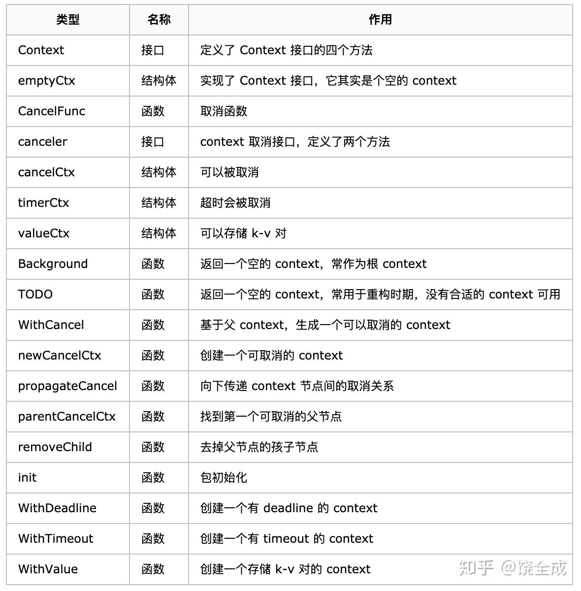
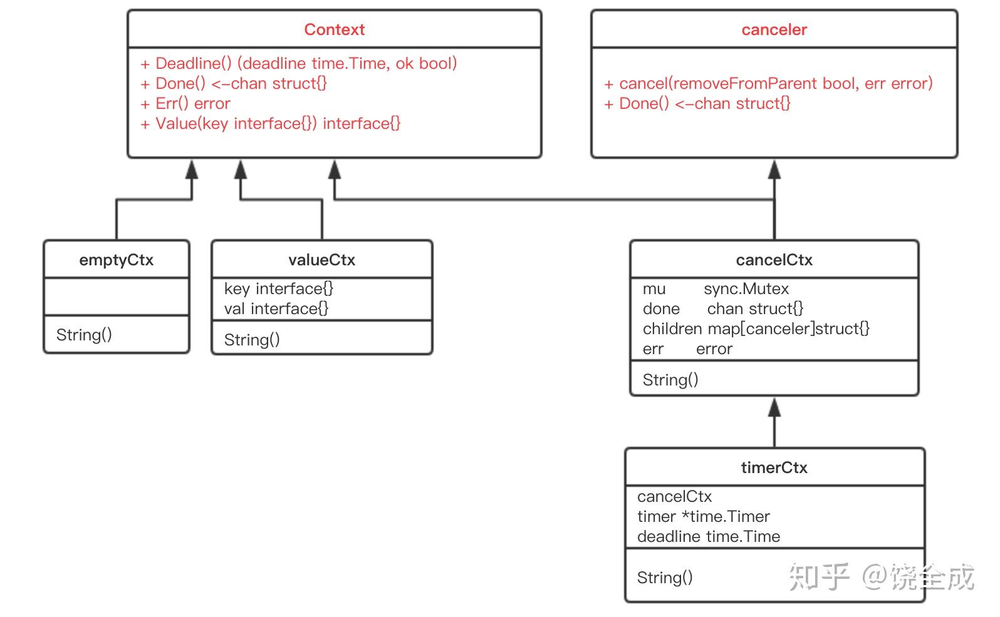
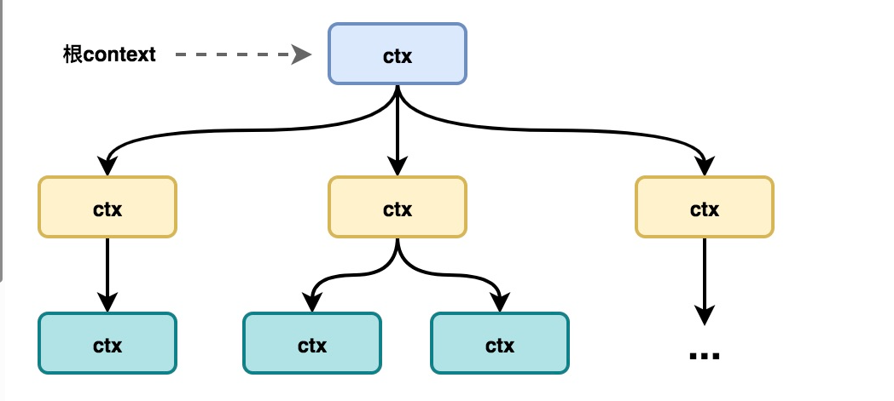

# go Context


参考链接
https://go.cyub.vip/concurrency/context/


### 什么是Context
Context 是一个接口类型,主要用于go中并发编程的控制

```go
type Context interface {
	Deadline() (deadline time.Time, ok bool) // 截止时间
	Done() <-chan struct{}  //携程结束
	Err() error  //错误信息
	Value(key any) any // 携程数据
}

```

Context接口一共包含四个方法：

Deadline：返回绑定该context任务的执行超时时间，若未设置，则ok等于false
Done：返回一个只读通道，当绑定该context的任务执行完成并调用cancel方法或者任务执行超时时候，该通道会被关闭
Err：返回一个错误，如果Done返回的通道未关闭则返回nil,如果context如果被取消，返回Canceled错误，如果超时则会返回DeadlineExceeded错误
Value：根据key返回，存储在context中k-v数据

#### context 主要功能一：**数据传递**
简单例子：

```go

package main

import (
	"context"
	"fmt"
)

type UserInfo struct {
	Name string
	Age  int
}

func main() {
	//生成一个上下文
	ctx := context.Background()
	// 传递数据
	ctx = context.WithValue(ctx, "name", "eiraaa")
	ctx = context.WithValue(ctx, "name2", UserInfo{
		Name: "eiraaa2",
		Age:  18,
	})
	GetUser(ctx)

}

func GetUser(ctx context.Context) {
	fmt.Println(ctx.Value("name"))
	fmt.Println(ctx.Value("name2"))
	//断言
	fmt.Println(ctx.Value("name2").(UserInfo).Age)

}


```
输出结果

```txt
eiraaa
{eiraaa2 18}
18

```
#### Context 主要功能二: **取消**
context 中有三种取消方式
- 取消携程 WithCancel
- 超时取消 
- 截止时间取消

取消携程 WithCancel
通过生成一个带 cancel 函数的 ctx 在调用cancel 的时候会向ctx.Done这个chan 里面写入，通过检测这个chan 可以实现结束携程

```go
package main

import (
	"context"
	"fmt"
	"sync"
	"time"
)

type UserInfo struct {
	Name string
	Age  int
}

var wait = sync.WaitGroup{}

func main() {
	wait.Add(3)
	fmt.Printf("并发任务开始：%s\n", time.Now())
	ctx1, cancelfunc1 := context.WithCancel(context.Background())
	ctx2, cancelfunc2 := context.WithCancel(context.Background())
	ctx3, cancelfunc3 := context.WithCancel(context.Background())
	go func() {
		WastTime(1, ctx1)

	}()
	go func() {
		WastTime(2, ctx2)

	}()
	go func() {
		WastTime(3, ctx3)
	}()

	go func() {
		// 取消携程2
		time.Sleep(1 * time.Second)
		cancelfunc1()
		time.Sleep(1 * time.Second)
		cancelfunc2()
		time.Sleep(1 * time.Second)
		cancelfunc3()
	}()
	wait.Wait()
	fmt.Printf("并发任务结束：%s\n", time.Now())
}

// 耗时操作
func WastTime(num int, ctx context.Context) {
	time1 := time.Now()
	defer func() {
		fmt.Printf("任务%d 经过%s 执行完成\n", num, (time.Since(time1)))
		wait.Done()
	}()

	go func() {
		select {
		case <-ctx.Done(): //执行就取消就取消
			{
				fmt.Printf("任务%d 经过%s 执行完成\n", num, (time.Since(time1)))
				wait.Done()
			}
		}
	}()

	fmt.Printf("任务%d 开始执行\n", num)
	time.Sleep(5 * time.Second)

}


```

```txt 
并发任务开始：2025-12-28 00:29:53.918588165 
任务1 开始执行
任务2 开始执行
任务3 开始执行
任务1 经过1.000370076s 执行完成
任务2 经过2.00094081s 执行完成
任务3 经过3.001245643s 执行完成
并发任务结束：2025-12-28 00:29:56.920040418 

```


截止时间取消 WithDeadline
生产一个带deadline 的ctx 到点会自动执向ctx.Done 里面写入

```go

package main

import (
	"context"
	"fmt"
	"sync"
	"time"
)

type UserInfo struct {
	Name string
	Age  int
}

var wait = sync.WaitGroup{}

func main() {
	wait.Add(3)
	fmt.Printf("并发任务开始：%s\n", time.Now())
	ctx1, _ := context.WithDeadline(context.Background(), time.Now().Add(1*time.Second))
	ctx2, _ := context.WithDeadline(context.Background(), time.Now().Add(2*time.Second))
	ctx3, _ := context.WithDeadline(context.Background(), time.Now().Add(3*time.Second))
	go func() {
		WastTime(1, ctx1)

	}()
	go func() {
		WastTime(2, ctx2)

	}()
	go func() {
		WastTime(3, ctx3)
	}()
	wait.Wait()
	fmt.Printf("并发任务结束：%s\n", time.Now())
}

// 耗时操作
func WastTime(num int, ctx context.Context) {
	time1 := time.Now()
	defer func() {
		fmt.Printf("任务%d 经过%s 执行完成\n", num, (time.Since(time1)))
		wait.Done()
	}()

	go func() {
		select {
		case <-ctx.Done(): //执行就取消就取消
			{
				fmt.Printf("任务%d 经过%s 执行完成\n", num, (time.Since(time1)))
				wait.Done()
			}
		}
	}()

	fmt.Printf("任务%d 开始执行\n", num)
	time.Sleep(5 * time.Second)

}


```

超时时间取消  WithTimeout
和截止时间基本一样，只是截止时间设定的是具体到的点，超时时间是具体等待秒数这里不做展示

### 部分与代码解析



关键方法和结构体
```go
type cancelCtx struct {
    Context

    mu       sync.Mutex
    done     chan struct{}
    children map[canceler]struct{}
    err      error
}

func (c *cancelCtx) Done() <-chan struct{} {
	d := c.done.Load()
	if d != nil {
		return d.(chan struct{})
	}
	c.mu.Lock()
	defer c.mu.Unlock()
	d = c.done.Load()
	if d == nil {
		d = make(chan struct{})
		c.done.Store(d)
	}
	return d.(chan struct{})
}


```

c.done 是“懒汉式”创建，只有调用了 Done() 方法的时候才会被创建。再次说明，函数返回的是一个只读的 channel，而且没有地方向这个 channel 里面写数据。所以，直接调用读这个 channel，协程会被 block 住。一般通过搭配 select 来使用。一旦关闭，就会立即读出零值。


```go

func (c *cancelCtx) cancel(removeFromParent bool, err, cause error) {
	if err == nil {
		panic("context: internal error: missing cancel error")
	}
	if cause == nil {
		cause = err
	}
	c.mu.Lock()
	if c.err.Load() != nil {
		c.mu.Unlock()
		return // 已经被其他协程取消
	}
	c.err.Store(err)
	c.cause = cause
	d, _ := c.done.Load().(chan struct{})
	if d == nil {
		c.done.Store(closedchan)
	} else {
		close(d)
	}
	// 遍历它的所有子节点
	for child := range c.children {
	 // 递归地取消所有子节点
	 // 这段是阻塞的也就是从最末尾的一级开始清除到本级的子ctx之后 再去调用下面的 children=nil
		child.cancel(false, err, cause)
	}
	 // 将子节点置空
	c.children = nil
	c.mu.Unlock()
 // 从父节点中移除自己 
	if removeFromParent {
		removeChild(c.Context, c)
	}
}

```
cancel 方法调用 WithCancel() 方法的时候，也就是新创建一个可取消的 context 节点时，返回的 cancelFunc 函数会传入 true。这样做的结果是：当调用返回的 cancelFunc 时，会将这个 context 从它的父节点里“除名”，因为父节点可能有很多子节点，你自己取消了，所以我要和你断绝关系，对其他人没影响。


context.WithCancel:
```go
func WithCancel(parent Context) (ctx Context, cancel CancelFunc) {
	c := withCancel(parent)
	return c, func() { c.cancel(true, Canceled, nil) }
}

//

func withCancel(parent Context) *cancelCtx {
	if parent == nil {
		panic("cannot create context from nil parent")
	}
	c := &cancelCtx{}
	c.propagateCancel(parent, c)
	return c
}

//context.propagateCancel 会构建父子上下文之间的关联，当父上下文被取消时，子上下文也会被取消
func (c *cancelCtx) propagateCancel(parent Context, child canceler) {
	c.Context = parent

	done := parent.Done()
	if done == nil {
		return // parent is never canceled
	}

	select {
	case <-done:
		// parent is already canceled
		child.cancel(false, parent.Err(), Cause(parent))
		return
	default:
	}
	//挂靠父ctx 如果父ctx 被取消了，就立刻取消自己
	if p, ok := parentCancelCtx(parent); ok {
		// parent is a *cancelCtx, or derives from one.
		p.mu.Lock()
		if err := p.err.Load(); err != nil {
			// parent has already been canceled
			child.cancel(false, err.(error), p.cause)
		} else {
			if p.children == nil {
				p.children = make(map[canceler]struct{})
			}
			p.children[child] = struct{}{}
		}
		p.mu.Unlock()
		return
	}

	if a, ok := parent.(afterFuncer); ok {
		// parent implements an AfterFunc method.
		c.mu.Lock()
		stop := a.AfterFunc(func() {
			child.cancel(false, parent.Err(), Cause(parent))
		})
		c.Context = stopCtx{
			Context: parent,
			stop:    stop,
		}
		c.mu.Unlock()
		return
	}

	goroutines.Add(1)
	go func() {
		select {
		case <-parent.Done():
			child.cancel(false, parent.Err(), Cause(parent))
		case <-child.Done():
		}
	}()
}


```

context.propagateCancel 的作用是在 parent 和 child 之间同步取消和结束的信号，保证在 parent 被取消时，child 也会收到对应的信号，不会出现状态不一致的情况。
该方法会关闭上下文中的 Channel 并向所有的子上下文同步取消信号
如果父ctx 实现了afterfunc,子进程可通过父ctx的afterfunc 函数机制顺带取消，是一种优化机制（子ctx 不会继承父ctx 的afterfunc）

```go
func parentCancelCtx(parent Context) (*cancelCtx, bool) {
	done := parent.Done()
	if done == closedchan || done == nil {
		return nil, false
	}
	p, ok := parent.Value(&cancelCtxKey).(*cancelCtx)
	if !ok {
		return nil, false
	}
	pdone, _ := p.done.Load().(chan struct{})
	if pdone != done {
		return nil, false
	}
	return p, true
}

```
parentCancelCtx 的目的是：在 Context 链中查找最近的 cancelCtx 实例，并验证它确实是当前 Context 的直系父级。


```go

func AfterFunc(ctx Context, f func()) (stop func() bool) {
	a := &afterFuncCtx{
		f: f,
	}
	a.cancelCtx.propagateCancel(ctx, a)
	return func() bool {
		stopped := false
		a.once.Do(func() {
			stopped = true
		})
		if stopped {
			a.cancel(true, Canceled, nil)
		}
		return stopped
	}
}
``` 
AfterFunc接口提供 上下文被取消时自动调用函数的功能


WithDeadline

```go
func WithDeadlineCause(parent Context, d time.Time, cause error) (Context, CancelFunc) {
	if parent == nil {
		panic("cannot create context from nil parent")
	}
	if cur, ok := parent.Deadline(); ok && cur.Before(d) {
		// The current deadline is already sooner than the new one.
		return WithCancel(parent)
	}
	c := &timerCtx{
		deadline: d,
	}
	c.cancelCtx.propagateCancel(parent, c)
	dur := time.Until(d)
	if dur <= 0 {
		c.cancel(true, DeadlineExceeded, cause) // deadline has already passed
		return c, func() { c.cancel(false, Canceled, nil) }
	}
	c.mu.Lock()
	defer c.mu.Unlock()
	if c.err.Load() == nil {
		c.timer = time.AfterFunc(dur, func() {
			c.cancel(true, DeadlineExceeded, cause)
		})
	}
	return c, func() { c.cancel(true, Canceled, nil) }
}

```

###  Context 树概念：
创建一个新的context，必须基于一个父context，新的context又可以作为其他context的父context。所有context在一起构造成一个context树，其可以在多个goroutine或者多个处理函数之间传递共享的信息。



