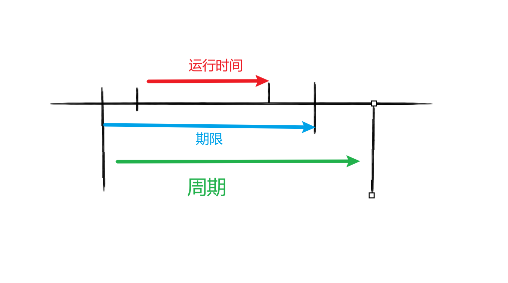

# linux 进程调度

**类型描述示例**交互式进程(interactive process)此类进程经常与用户进行交互, 因此需要花费很多时间等待键盘和鼠标操作. 当接受了用户的输入后, 进程必须很快被唤醒, 否则用户会感觉系统反应迟钝shell, 文本编辑程序和图形应用程序批处理进程(batch process)此类进程不必与用户交互, 因此经常在后台运行. 因为这样的进程不必很快相应, 因此常受到调度程序的怠慢程序语言的编译程序, [数据库](https://cloud.tencent.com/product/tencentdb-catalog?from_column=20065&from=20065)搜索引擎以及科学计算实时进程(real-time process)这些进程由很强的调度需要, 这样的进程绝不会被低优先级的进程阻塞在linux中, 调度算法可以明确的确认所有实时进程的身份, 但是没办法区分交互式程序和批处理程序

### **进程的分类**

**linux**把进程区分为实时进程和非实时进程, 其中非实时进程进一步划分为**交互式进**程和**批处理进程**


在 CPU 的角度看进程行为的话，可以分为两类：

* CPU 消耗型：此类进程就是一直占用 CPU 计算，CPU 利用率很高
* IO 消耗型：此类进程会涉及到 IO，需要和用户交互，比如键盘输入，占用 CPU 不是很高，只需要 CPU 的一部分计算，大多数时间是在等待 IO


#### **不同进程采用不同的调度策略**

对于实时进程，采用FIFO或者Round Robin的调度策略.

对于普通进程，需要区分交互式和批处理式的不同使用CFS和RSDL等新的调度器

*注意Linux通过将进程和线程调度视为一个，同时包含二者。进程可以看做是单个线程，但是进程可以包含共享一定资源（代码和/或数据）的多个线程。因此进程调度也包含了线程调度的功能.*


#### 进程抢占参数

- CONFIG_PREEMPT_NONE：不开启内核抢占，该模式注重系统吞吐量，通过允许任务在没有中断的秦康下执行更惨时间，减少上下文切换的次数
- CONFIG_PREEMP： 开启内核抢占，实时性高，但会增加内核调度判断，降低性能
- CONFIG_PREEMPT_VOLUNTARY：自愿抢占，实现方式是内核在很多可以睡眠的地方插入了调度，是一种折中方案，允许低优先级进程在内核模式下执行系统调用时自愿进行抢占，以使应用程序在系统负载较大的时候能够流畅运行自愿内核抢占模型使用宏 `might_sleep()` 函数在内核里面增加抢占点
- CONFIG_PREEMPT_RT：完全抢占内核，也称为实时内核  注意：把配置宏从CONFIG_PREEMPT_RT_FULL修改为CONFIG_PREEMPT_RT。


内核的进程调度功能是根据这三个参数编译出不同的功能，无法在编译之后调整

```c

//linux-5.4.286/kernel/sched/core.c   5712

#ifndef CONFIG_PREEMPTION   // 根据 变量配置选择是否编译这段内容
int __sched _cond_resched(void) // 看当前内核是否需要重新调度
{
	if (should_resched(0)) { //如果需要调度
		preempt_schedule_common();  //执行调度逻辑
		return 1;
	}
	rcu_all_qs();//
	return 0;
}
EXPORT_SYMBOL(_cond_resched);
#endif
```


#### 实时内核 PREEMPT_RT

标准的 Linux 内核设计并不是为实时应用优化的，主要目标是提高多任务处理和吞吐量，而非降低任务响应时间和确保任务及时执行。虽然 Linux 内核本身提供了调度和抢占机制（如 `CONFIG_PREEMPT` 选项），但是在低延迟和精确时效性方面，Linux 还是无法与专用的实时操作系统（RTOS）竞争。

**PREEMPT_RT** 补丁通过进一步改进内核的调度机制，消除了可能导致任务延迟的部分非抢占行为，并优化了内核代码的可预测性和响应性，使得 Linux 内核能够满足更严格的实时要求。

**PREEMPT_RT 的核心功能**

1. **减少内核锁的持有时间** ：

* 内核中的很多锁（如 `spinlock`）通常是不可中断的，这可能导致其他任务长时间无法执行。PREEMPT_RT 将这些锁的持有时间缩短，减少了发生延迟的机会。

1. **增加内核级抢占** ：

* 默认的 Linux 内核可能会在一些关键操作（如内存分配、锁获取等）中执行长时间的不可抢占操作。PREEMPT_RT 消除了这些不可抢占的区域，使得内核能够在这些时刻更及时地调度其他任务。

1. **增强中断响应性** ：

* PREEMPT_RT 通过将一些中断处理逻辑变为可抢占的形式，确保中断处理过程对实时任务的响应时间尽可能短。

1. **实时调度器改进** ：

* PREEMPT_RT 引入了实时调度器（如 `SCHED_FIFO`、`SCHED_RR`）的改进，使得实时任务在与普通任务并发执行时能够获得更高的优先级，避免被其他低优先级任务抢占。

  需要自行下载补丁进行配置编译

也可以选择启用 `CONFIG_PREEMP `选项，以配合 `PREEMPT_RT` 实现更强的抢占能力。


## 调度策略

### 实时调度器POSIX

先进先出调度SCHED_FIFO


轮流调度SCHED_RR


### 限期调度器 

限期调度策略 SCHED_DEADLINE 

限期调度策略有3个参数： 运行时间runtime、截止期限deadline  和周期 period




每个周期运行一次，在截止期限之前执行完，一次运行的时间长度是runtime。


### deadline 调度器


### **CFS调度器Completely Fair Scheduler**

## 优先级时间片分析


## 经典算法


## 调度常用数据结构
