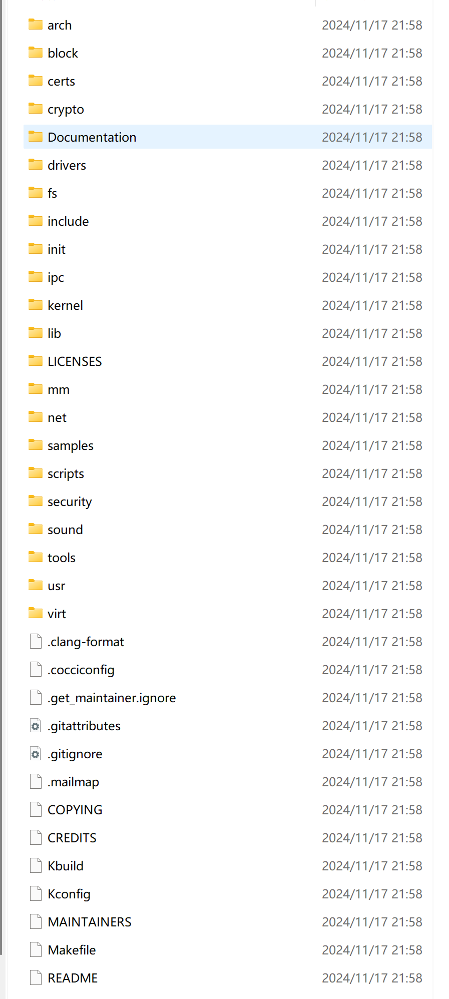

# linux 内核学习序章

linux 系统10个主要模块

- 进程管理 —— 进程创建、调度、同步、通信、终止进程和线程
- 内存管理 ——  分配管理内存资源   虚拟内存，物理内存
- 文件系统 —— 文件存储、组织、检索和管理
- 设备驱动 —— 管理各种硬件设备（输入输出、存储设备）
- 网络通信 —— 提供网络接口和通信协议（支持网络连接和数据传输）
- 用户接口 —— 提供系统与用户的交互接口
- 系统调用 —— 为用户程序提供与操作系统交互的接口
- 资源分配 —— 负责各种资源的分配 cpu时间，内存空间 io调度
- 系统服务 —— 提供基础的服务 如时间和日期服务，打印
- 虚拟化技术 —— 允许多个系统在同一硬件平台上执行

linux 内核六大架构

- 进程调度 Process Scheduler
- 内存管理 MemoryManager
- 虚拟文件系统 Virtual File System VFS
- 网络子系统 Network
- 进程间同喜 Inter-Process Communication IPC
- 设备驱动 Device Drivers
- 系统调用接口  System Call Interface

linux内核重要数据结构

- task_struct
- mm_struct
- file_operations
- vfsmount
- dentry
- indoe
- page
- sk_buff
- list_head
- timer_list
- wait_queue_head_t
- completion
- rw)senaphone
- atomic_t
- seq_file
- cgroup
- socket
- module
- sys_device
- kibject

linux 源码目录结构

- arch 包含硬件体系结构相关代码
- block  块，设备驱动的i/o 调试
- crypto 常用加密和散列算法
- documentation： 内核各部分通用的解释和注释
- Drivers: 设备驱动程序
- Fs 支持的各种文件系统
- init linux内核初始化代码
- ipc 进程间通信的代码
- Kernel 内核最核心的部分 （进程调度，定时器）；
- lib 库文件代码
- Mm 内存管理代码
- Net网络相关代码
- Scripts 配置内核的脚本文件
- Security 主要是一个Selinux 的模块
- Sound：  音频设备的驱动核心代码
- Usr 实现用于打爆和亚索的cpio

## linux 源码阅读常见定义

**宏**

在C语言中，可以采用[命令](https://www.forlinx.com/article-new-c22/357.html)#define来定义宏。该命令允许把一个名称指定成任何所需的文本，例如一个常量值或者一条语句。在定义了宏之后，无论宏名称出现在源代码的何处，预处理器都会把它用定义时指定的文本替换掉。宏是没有返回值的

参考

https://www.forlinx.com/article-new-c22/365.html

static  :这段代码作用域为本文件，无法在外部调用

inline ：提示编译器在调用该函数的地方直接插入代码，避免函数调用开销

volatile 告诉编译器不要优化这个汇编语句，确保它始终被执行，即使空的汇编语句实际上并不执行任何操作

**`notrace`** 一个宏，用于标记函数或代码段，避免被内核的函数跟踪器追踪、保证原子性，避免无限递归

EXPORT_SYMBOL( ) linux 中的一个宏，用于将符号、变量导出，使他们可以被内核其他模块访问
