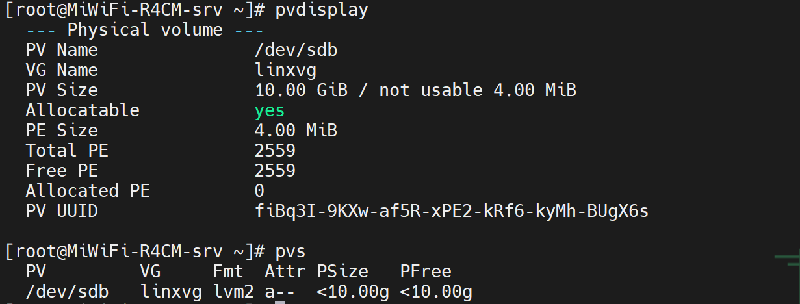
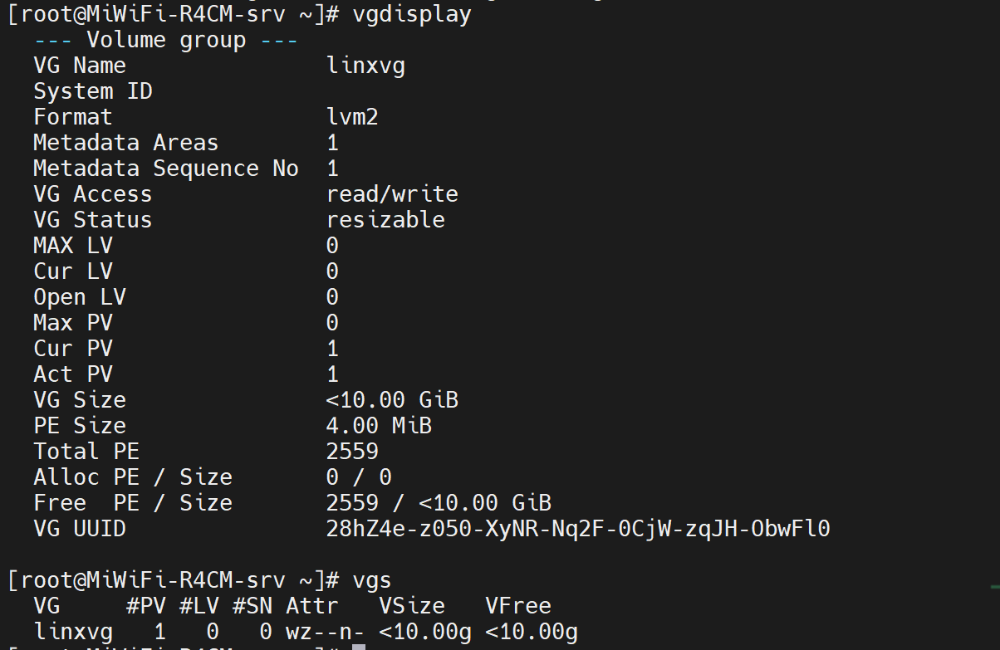
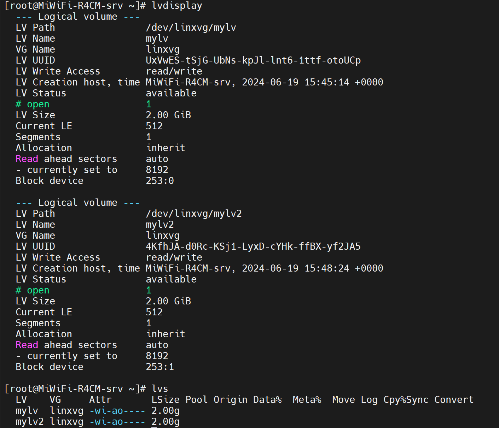
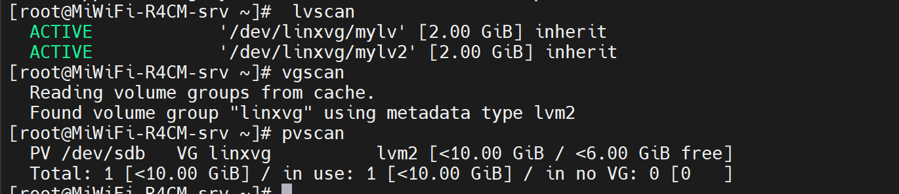
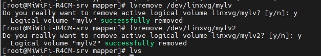

# LVM

**LVM 动态磁盘管理机制，抽象封装底层物理硬盘，向上表现为逻辑卷，上城系统不直与磁盘交互。**

**pE physical extend  物理扩展，逻辑卷管理的最小单位 默认是4M大小**

**PV physical volume   物理卷  **

**VG volume group  卷组（可以理解为空间池）   **

**LV logical volume  逻辑卷  **

`在创建卷组和逻辑卷的时候都要起名字，逻辑卷创好之后在/dev/下面出现 /dev/vgname/lvname 这样一个路径`

**逻辑卷第一步操作就是将物理硬盘格式化为一个个pe （把多个红薯打成碎末）**

**创建VG ,可以将一个或者多个PE加入到VG中，相当与吧切碎的作为一个整体（红薯面团）**

**创建LV                         (面团做成自定义个大小的红薯饼)**

**查看物理卷的：**

**pvdisplay**

**pvs**



**查看卷组:**

**vgdisplay**

**vgs**



**查看逻辑卷：**

**lvdsiplay**

**lvs**



**其他有用的命令**

**lvscan**：扫描系统中的所有逻辑卷并显示它们的信息。
****vgscan**：**扫描系统中的所有卷组并显示它们的信息。
**pvscan**：扫描系统中的所有物理卷并显示它们的信息。



## 基本流程

**##创建lv**

```
pvcreate /dev/sdb /dev/sdc
vgcreate vgname /dev/sdb /dev/sdc
lvcreate  -n lvname -L 2G  vgname
mkfs.xfs  /dev/vgname/lvname
mount /dev/vgname/lvname  /opt
  
```

**注意：创建pv的时候是把单个磁盘按4兆划分好，所以sdb sdc 两个还是独立的**

**/dev/vgname/lvname 这个其实是个链接，真实路径是在/dev/mapper下面**

### 删除lvm

**先umount 挂载**

**lvremove /dev/vgname/lvname**



**vgremove /dev/vgname**
**pvremove /dev/sdb/sdc**

---

## # lvm  的扩大与缩小

**逻辑卷的拉伸是可以在线执行的，就算当前逻辑卷正在使用，进行扩容也不会影响使用**

**拉伸和缩小都不会影响逻辑卷中的数据**

**vgdisplay 保证vg中有足够的空间**

**lvextend -L  +1G  /dev/vgname/lvname**

**lvdisplay 查看lv大小**

**更新文件系统**

**resize2fs /dev/vgname/lvnname**

**df -h**

#### 当vg卷组空间不够的时候扩充VG

**加入一块新的硬盘 sdd**

**pvcreate /dev/sdd**
vgextend  vg_to_extend  /dev/sdd

### 缩小逻辑卷

**缩小文件系统要unmount 而且是先缩小上城文件系统**

umount  /dev/vgname/lvname
resize2fs /dev/vgname/lvname 9G 缩小文件系统
lvreduce -L -1G /dev/vgname/lvname  缩小lv
lvdisplay
mount  /dev/vgname/lvname /opt
resize 的大小和最后缩小的大小要一致不然可能会损坏文件系统
