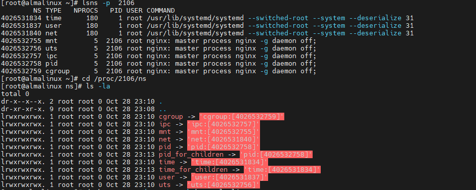

# **Linux 中的namespace 和cgroup**

namespace 技术和cgroup 技术是容器技术的基础，提供了 网络，文件挂载系统，进程，用户和用户组，主机名与NIS域名，cpu，memory资源的隔离

`unshare` 命令用于在 Linux 中创建新的命名空间，并在该命名空间中执行命令。它可以让你隔离资源，如进程 ID、网络、挂载点等，以实现容器化或测试环境，六个namespace unshare 命令都可以创建

unshare 命令创建新的命名空间是，启动新pid命名空间的进程被称为unshare 进程，并不会进入新的命名空间；之后它的子进程会进入


## namespace

基础namespace

| 名称   | 宏定义          | 隔离资源                                                                                                                                              | 内核版本 |
| ------ | --------------- | ----------------------------------------------------------------------------------------------------------------------------------------------------- | -------- |
| mnt    | CLONE_NEWNS     | Mount point                                                                                                                                           | 2.4.19   |
| ipc    | CLONE_NEWIPC    | System V IPC, POSIX message queue                                                                                                                     | 2.6.19   |
| net    | CLONE_NEWNET    | network device interface, IPv4 and IPv6 protocol stack, IP routing table, firewall rule, the /proc/net and /sys/class/net directory tree, socket, etc | 2.6.24   |
| pid    | CLONE_NEWPID    | Process ID                                                                                                                                            | 2.6.24   |
| user   | CLONE_NEWUSER   | User and group ID                                                                                                                                     | 3.8      |
| UTS    | CLONE_NEWUTS    | Hostname and NIS domain name                                                                                                                          | 2.6.19   |
| cgroup | CLONE_NEWCGROUP | Control group root directory                                                                                                                          | 4.6      |

以上的namespace 基本覆盖程序运行所需的环境包括主机名、用户权限、文件系统、网络、进程号、进程间通信。所有的进程都会有namespace，可以理解为namespace是进程的一个属性。

查看某个进程的namespace ：

- `lsns -p <pid>`
- 查看/proc/`<pid>`/ns 目录 查看某个进程的所有namespace



每个进程的每个namespace 类型都指向一个namespace 编号

就ipc这个namespace类型来说，ipc -> ipc:[4026532560]中，ipc是namespace类型，4026532560是inode number。假设两个进程的ipc namespace下的inode number一样，说明这两个进程属于同一个namespace。对于其它的namespace类型也一样。

### pid namespace

设置两个容器的pid命名空间相同：
`docker  run -td --name xxx --pid=container:another_container_name `


可以看到两个进程的pid namespace 有相同的inode 编号，此时在almalinux容器中可以看到nginx容器内的进程

容器和宿主机共享pid命名空间：
`docker run --pid=host`

### uts namespace

UTS namespace 是用来隔离系统的hostname以及NIS domain name

### ipc namespace

IPC 全程Inter-Process-Communication  是linux 下进程间通信的一种方式，IPC 有共享内存，信号量，消息队列等方法，只有在同一个ipc namespace 下的进程之间才能通信

### mount namespace

mount namespace 用来隔离文件系统的挂载点，使得不同的mount anmespace 拥有自己的独立挂载点信息，不同的namespace 之间不会互相影响

mount namespace可隔离出一个具有独立挂载点信息的运行环境，内核知道如何去维护每个namespace的挂载点列表。即 **「每个namespace之间的挂载点列表是独立的，各自挂载互不影响」** 。

内核将每个进程的挂载点信息保存在 `/proc/<pid>/{mountinfo,mounts,mountstats}`三个文件中：


**「具有独立的挂载点信息，意味着每个mnt namespace可具有独立的目录层次」** ，这在容器中起了很大作用：容器可以挂载只属于自己的文件系统。当创建mount namespace时，内核将拷贝一份当前namespace的挂载点信息列表到新的mnt namespace中，此后两个mnt namespace就没有了任何关系(不是真的毫无关系）

创建mount namespace  使用unshare -m 选项

`unshare --mount --uts <program>`

实验：

```bash
[~]->$ cd
[~]->$ mkdir iso
[~]->$ cd iso
[iso]->$ mkdir -p iso1/dir1
[iso]->$ mkdir -p iso2/dir2  
[iso]->$ mkisofs -o 1.iso iso1  # 将iso1目录制作成镜像文件1.iso
[iso]->$ mkisofs -o 2.iso iso2  # 将iso2目录制作成镜像文件2.iso
[iso]->$ ls
1.iso  2.iso  iso1  iso2
[iso]->$ sudo mkdir /mnt/{iso1,iso2}
[iso]->$ ls -l /proc/$$/ns/mnt
lrwxrwxrwx 1 ... /proc/26276/ns/mnt -> 'mnt:[4026531840]'
 
# 在root namespace中挂载1.iso到/mnt/iso1目录
[iso]->$ sudo mount 1.iso /mnt/iso1  
mount: /mnt/iso: WARNING: device write-protected, mounted read-only.
[iso]->$ mount | grep iso1
/home/longshuai/iso/1.iso on /mnt/iso1 type iso9660
 
# 创建mount+uts namespace
[iso]->$ sudo unshare -m -u /bin/bash
# 虽然这个namespace是mount+uts的namespace
# 但注意mnt namespace和uts namespace的inode并不一样
root@longshuai-vm:/home/longshuai/iso# ls -l /proc/$$/ns
lrwxrwxrwx ... cgroup -> 'cgroup:[4026531835]'
lrwxrwxrwx ... ipc -> 'ipc:[4026531839]'
lrwxrwxrwx ... mnt -> 'mnt:[4026532588]'
lrwxrwxrwx ... net -> 'net:[4026531992]'
lrwxrwxrwx ... pid -> 'pid:[4026531836]'
lrwxrwxrwx ... pid_for_children -> 'pid:[4026531836]'
lrwxrwxrwx ... user -> 'user:[4026531837]'
lrwxrwxrwx ... uts -> 'uts:[4026532589]'
 
# 修改主机名为ns1
root@longshuai-vm:/home/longshuai/iso# hostname ns1
root@longshuai-vm:/home/longshuai/iso# exec $SHELL
 
# 在namespace中，可以看到root namespace中的挂载信息
root@ns1:/home/longshuai/iso# mount | grep 'iso1' 
/home/longshuai/iso/1.iso1 on /mnt/iso1 type iso9660
 
# namespace中挂载2.iso2
root@ns1:/home/longshuai/iso# mount 2.iso2 /mnt/iso2/
mount: /mnt/iso2: WARNING: device write-protected, mounted read-only.
root@ns1:/home/longshuai/iso# mount | grep 'iso[12]'
/home/longshuai/iso/1.iso1 on /mnt/iso1 type iso9660
/home/longshuai/iso/2.iso2 on /mnt/iso2 type iso9660
 
# 在namespace中卸载iso1
root@ns1:/home/longshuai/iso# umount /mnt/iso1/
root@ns1:/home/longshuai/iso# mount | grep 'iso[12]' 
/home/longshuai/iso/2.iso2 on /mnt/iso2 type iso9660
root@ns1:/home/longshuai/iso# ls /mnt/iso1/
root@ns1:/home/longshuai/iso# ls /mnt/iso2
dir2
 
#### 打开另一个Shell终端窗口
# iso1挂载仍然存在，且没有iso2的挂载信息
[iso]->$ mount | grep iso
/home/longshuai/iso/1.iso1 on /mnt/iso1 type iso9660
[iso]->$ ls /mnt/iso2
[iso]->$ ls /mnt/iso1
dir1
```


### net namesapce

在linux 中，网络命名空间可以被认为是隔离的拥有单独网络栈（网卡、路由转发表、iptabels）的环境、网络命名空间常用来把隔离网络设备和服务，只有拥有同样网络名字的空间设备才能看到彼此

从逻辑上说，网络命名空间是网络栈的副本，有自己的网络设备、路由选择表、邻接表、Netfilter表、网络套接字、网络procfs条目、网络sysfs条目和其他网络资源。

从系统的角度来看，当通过clone()系统调用创建新进程时，传递标志CLONE_NEWNET将在新进程中创建一个全新的网络命名空间。

查看netns

- `ip netns list`
- `ls /var/run/netns/`
- `lsns -t net`


创建网络命名空间

```
ip netns add ns1  #创建一个新的网络命名空间 

ip link add veth0 type veth peer name veth1  # 创建新的虚拟网卡 
```

* `ip link add`: 这是用于添加新的网络设备的命令。
* `veth0`: 这是你要创建的第一个虚拟以太网设备的名称。可以在网络中用作一个接口。
* `type veth`: 指定你要创建的设备类型是虚拟以太网设备（veth），它们是成对创建的设备。
* `peer name veth1`: 创建一对虚拟以太网设备，其中 `veth1` 是配对的第二个设备的名称。`veth0` 和 `veth1` 将相互连接，数据包从一个设备发出后会进入另一个设备。

```
ip link set veth1 netns ns1  #将其中一个网卡转移到命名空间ns1 中
ipnetns exec ns1 ip link list  #验证
```


```
#配置命名空间中的端口
ip netns exec ns1 ip addr add 10.1.1.1/24 dev veth1
ip netns exec ns1 ip link set veth1 up
ip netns exec ns1 ip link set lo up
ip netns exec ns1 ip addr show dev veth1


```


```
配置主机上网卡ip:
ip addr add 10.1.1.2/24 dev veth0
ip link set veth0 up
```


可以看到一个网络命名空间中有自己的虚拟网卡，ip 路由

删除这个net namespace 中的路由就无法访问其他的namespace 


### user namespace

创建用户命名空间

unshare -user -r  /bin/bash

两容器共用user  命名空间

`docker run -d --name container2 --userns=container:container1 your-image`

查看所有 的user命名空间

`sudo find /proc -maxdepth 3 -type l -name user -exec readlink {} \; 2>/dev/null | sort -u`


## linux cgroup

cgroups，其名称源自控制组群（control groups）的缩写，是内核的一个特性，用于限制、记录和隔离一组进程的资源使用（CPU、内存、磁盘 I/O、网络等）

 **资源限制** ：可以配置 cgroup，从而限制进程可以对特定资源（例如内存或 CPU）的使用量

**优先级** ：当资源发生冲突时，您可以控制一个进程相比另一个 cgroup 中的进程可以使用的资源量（CPU、磁盘或网络）

 **记录** ：在 cgroup 级别监控和报告资源限制

Cgroups功能的实现依赖于四个核心概念：**子系统、控制组、层级树、任务**

在/sys/fs/cgroup/这个目录下可以看到cgroup子系统


* **cpu** ：使用调度程序控制任务对cpu的使用
* **cpuacct** ：自动生成cgroup中任务对cpu资源使用情况的报告
* **cpuset** ：可以为cgroup中的任务分配独立的cpu和内存
* **blkio** ：可以为块设备设定输入 输出限制，比如物理驱动设备
* **devices** ：可以开启或关闭cgroup中任务对设备的访问
* **freezer** ： 可以挂起或恢复cgroup中的任务
* **pids** ：限制任务数量
* **memory** ：可以设定cgroup中任务对内存使用量的限定，并且自动生成这些任务对内存资源使用情况的报告
* **perf_event** ：使用后使cgroup中的任务可以进行统一的性能测试
* **net_cls** ：docker没有直接使用它，它通过使用等级识别符标记网络数据包，从而允许linux流量控制程序识别从具体cgroup中生成的数据包

cgroup中，任务就是一个进程，一个任务可以是多个cgroup的成员，但这些cgroup必须位于不同的层级，子进程自动成为父进程cgroup的成员，可按需求将子进程移到不同的cgroup中

cgroup 的作用基本上就是控制一个进程或一组进程可以访问或使用给定关键资源（CPU、内存、网络和磁盘 I/O）的量。一个容器中通常运行了多个进程，并且您需要对这些进程实施统一控制，因此 cgroup 是容器的关键组件。Kubernetes 环境使用cgroup 在 pod 级别上部署[资源请求和限制](https://link.zhihu.com/?target=https%3A//github.com/kubernetes/community/blob/master/contributors/design-proposals/node/node-allocatable.md%23recommended-cgroups-setup)以及对应的 QoS 类


### cgroups 简单使用

#### 常规使用

**cgroups v1 和v2的使用方式有所不同，这里以v2为例 查看cgroups是v1还是v2的命令：**

`stat -fc %T /sys/fs/cgroup/`

如果输出是 `cgroup2fs` 那就是 V2,如果输出是 `tmpfs` 那就是 V1


创建test.sh 脚本 (跑起来的时候会吃满cpu)

```bash
#!/bin/bash
while true;do
    echo "1"
done
```


编译c内存申请程序(执行时候会无限吃内存)

```c
#include <stdio.h>
#include <stdlib.h>
#include <string.h>
#include <unistd.h>

#define MB (1024 * 1024)

int main(int argc, char *argv[])
{
    char *p;
    int i = 0;
    while(1) {
        p = (char *)malloc(MB);
        memset(p, 0, MB);
        printf("%dM memory allocated\n", ++i);
        sleep(10);
    }

    return 0;
}
```

编译

```bash
gcc ~/mem-allocate.c -o ~/mem-allocate
```


```bash
#限制进程进程只用20%cpu
mkdir /sys/fs/cgroup/eiraaa 
echo 2000 10000 > /sys/fs/cgroup/eiraaa/cpu.max
echo <pid> /sys/fs/cgroup/eiraaa/cgroup.procs

#限制进程只用10M 内存
echo <pid> /sys/fs/cgroup/eiraaa/cgroup.procs
echo 10485760 > /sys/fs/cgroup/eiraaa/memory.max

```
